# Continue 代码仓库架构深度分析

## 目录

1. [整体架构概览](#整体架构概览)
2. [核心功能详解](#核心功能详解)
3. [核心原理深度解析](#核心原理深度解析)
4. [总结](#总结)

## 整体架构概览

Continue是一个开源的AI编程助手，支持多种IDE和AI模型。其架构设计采用了高度模块化的方式，主要包含以下几个层次：

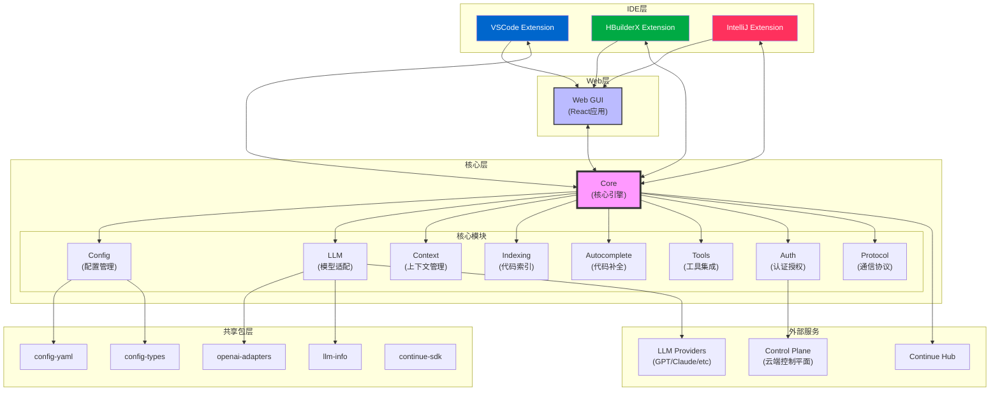

### Core层详细架构

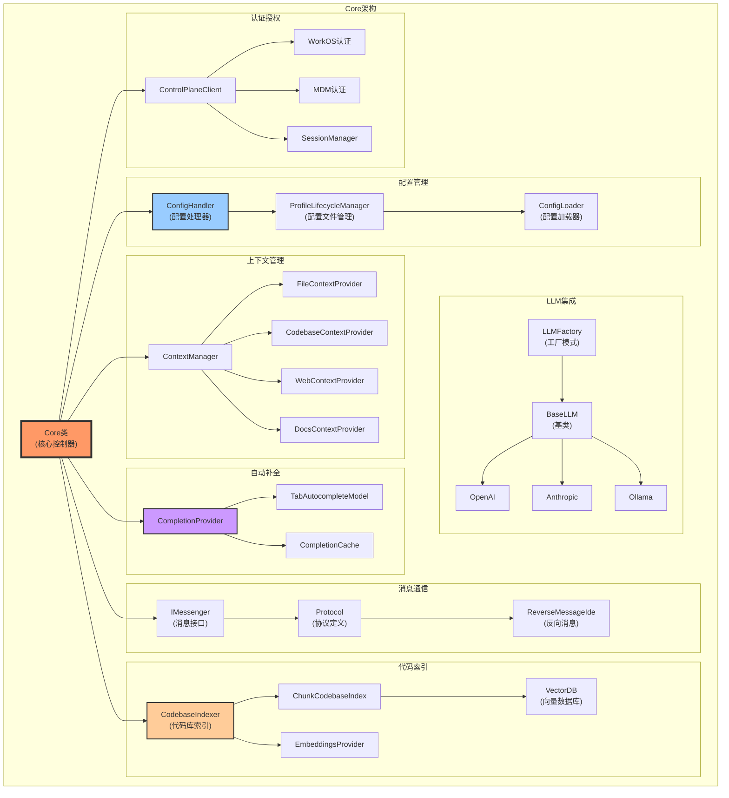

## 核心功能详解

### 1. 消息通信架构

Continue使用了一套完整的消息通信机制来实现IDE、GUI和Core之间的通信：

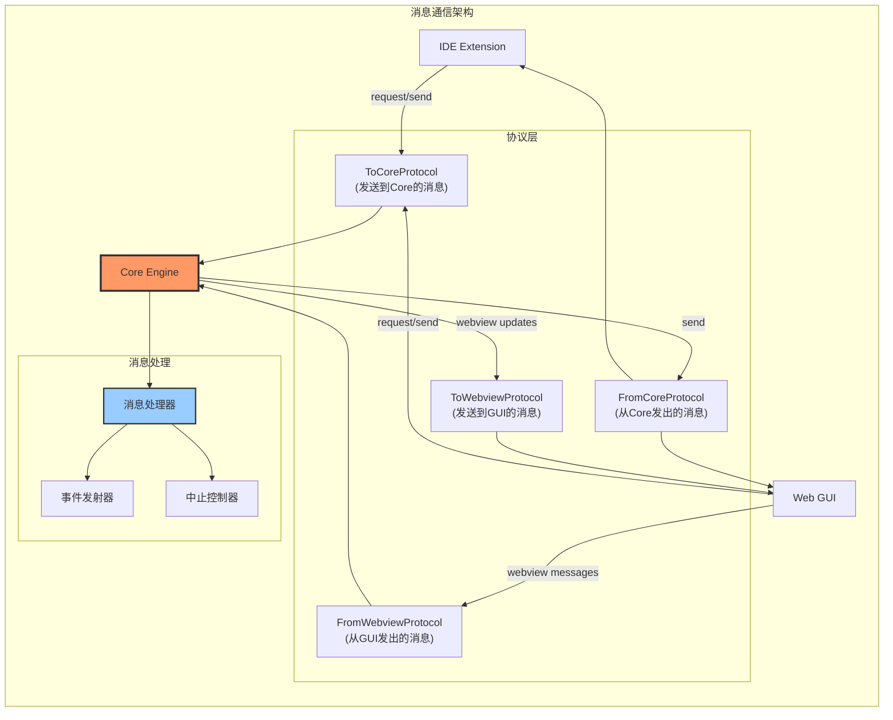

### 2. 代码索引架构

Continue使用向量数据库和嵌入技术来实现智能代码搜索：

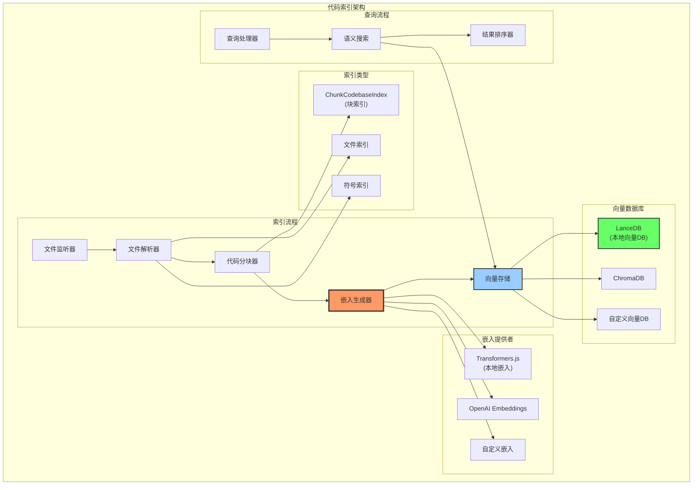

### 3. Agent工作流程 - 从用户输入到代码修改

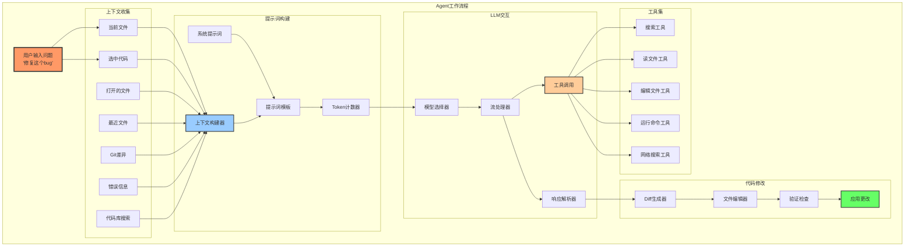

### 4. LLM集成架构

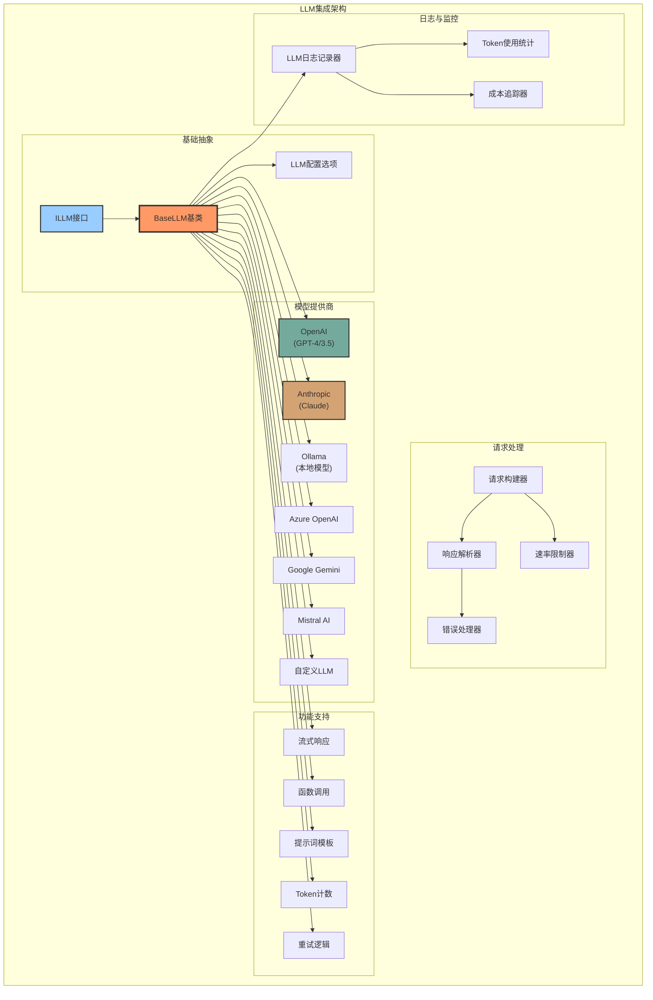

### 5. 上下文管理系统

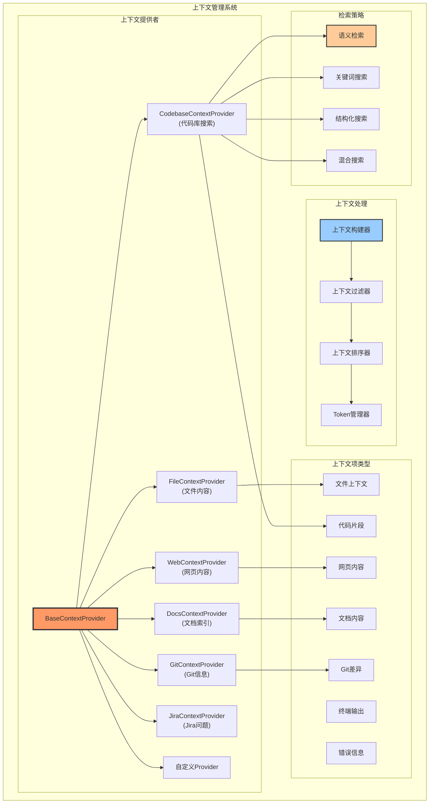

### 6. 代码补全系统架构

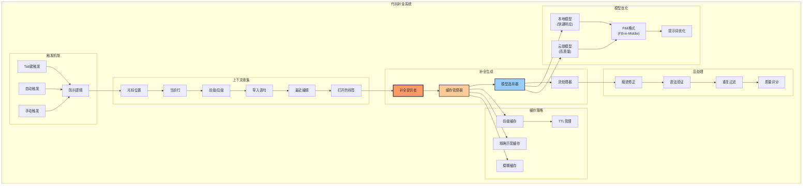

### 7. 配置管理系统

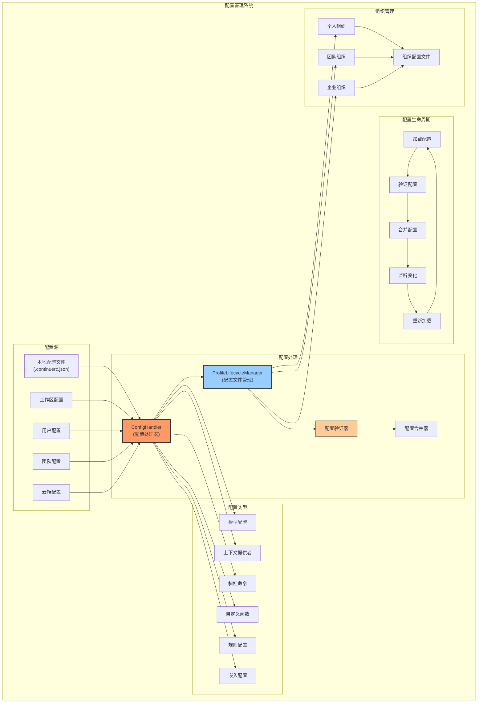

### 8. 典型用户交互流程 - Agent场景详解

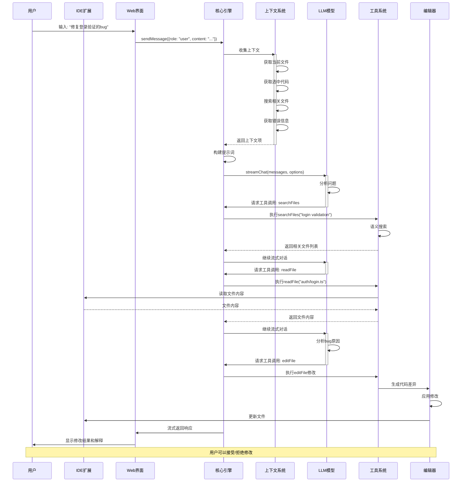

## 核心原理深度解析

### 1. 模块化架构设计

Continue采用高度模块化的架构设计，主要优势包括：

- **插件化LLM支持**：通过统一的`ILLM`接口和`BaseLLM`基类，可以轻松添加新的模型提供商
- **可扩展的上下文系统**：基于`BaseContextProvider`的插件机制，支持自定义上下文源
- **灵活的工具系统**：工具通过统一接口注册，支持自定义工具扩展

### 2. 流式处理机制

整个系统大量使用异步生成器和流式处理：

```typescript
// 流式处理的核心优势
async function* streamDiffLines(): AsyncGenerator<DiffLine> {
  // 1. 实时响应 - 用户可以立即看到输出
  // 2. 内存效率 - 不需要等待完整响应
  // 3. 可中断性 - 支持随时取消操作
}
```

### 3. 智能上下文管理

Continue的上下文系统具有以下特点：

1. **多源融合**：整合文件、代码库、Git、文档等多种上下文源
2. **智能排序**：基于相关性和重要性对上下文进行排序
3. **Token优化**：自动管理上下文大小，确保不超过模型限制

### 4. 工具系统设计

工具系统的核心设计理念：

1. **统一接口**：所有工具都实现相同的接口，返回`ContextItem[]`
2. **可扩展性**：支持内置工具、HTTP工具和MCP（Model Context Protocol）工具
3. **错误处理**：优雅的错误处理机制，确保工具调用失败不会中断整个流程

```typescript
// 工具调用的核心实现
export async function callTool(
  tool: Tool,
  callArgs: string,
  extras: ToolExtras,
): Promise<{
  contextItems: ContextItem[];
  errorMessage: string | undefined;
}> {
  try {
    const args = JSON.parse(callArgs || "{}");
    const contextItems = tool.uri
      ? await callToolFromUri(tool.uri, args, extras)
      : await callBuiltInTool(tool.function.name, args, extras);
    return {
      contextItems,
      errorMessage: undefined,
    };
  } catch (e) {
    return {
      contextItems: [],
      errorMessage: e.message,
    };
  }
}
```

### 5. 性能优化策略

Continue在性能优化方面采用了多种策略：

1. **LRU缓存**：使用最近最少使用算法管理缓存，提高响应速度
2. **SQLite存储**：使用轻量级数据库存储缓存和索引数据
3. **并发控制**：使用Mutex确保数据一致性
4. **流式处理**：避免内存溢出，提供实时反馈

```typescript
export class AutocompleteLruCache {
  private static capacity = 1000;
  private mutex = new Mutex();

  async get(prefix: string): Promise<string | undefined> {
    // 智能前缀匹配
    const result = await this.db.get(
      "SELECT key, value FROM cache WHERE ? LIKE key || '%' ORDER BY LENGTH(key) DESC LIMIT 1",
      prefix,
    );
    return result?.value;
  }
}
```

### 6. 错误处理和恢复机制

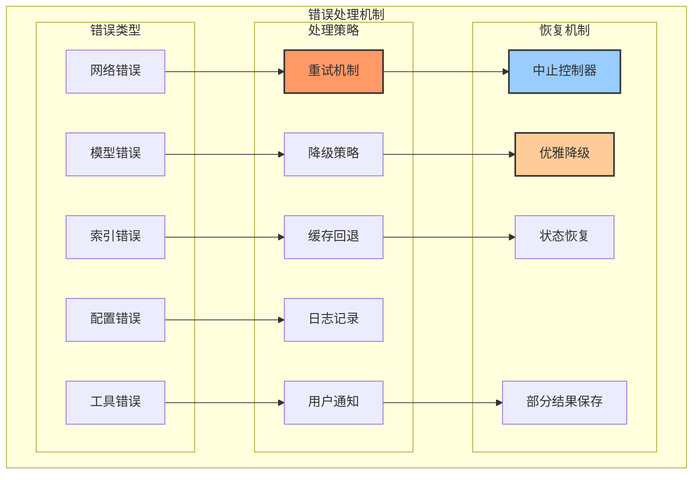

### 7. 认证架构

Continue支持三种认证模式：

1. **WorkOS生产环境认证** (`WorkOsProd`)
2. **WorkOS测试环境认证** (`WorkOsStaging`)
3. **本地私有部署认证** (`OnPrem`)

核心认证流程：

```typescript
// 认证类型定义
export interface HubSessionInfo {
  AUTH_TYPE: AuthType.WorkOsProd | AuthType.WorkOsStaging;
  accessToken: string;
  account: {
    label: string;
    id: string;
  };
}

export interface OnPremSessionInfo {
  AUTH_TYPE: AuthType.OnPrem;
}

// 许可证验证
export function validateLicenseKey(licenseKey: string): boolean {
  // 1. 解码base64许可证密钥
  // 2. 验证数字签名
  // 3. 检查许可证过期时间
  const verify = crypto.createVerify("SHA256");
  verify.update(data);
  const isValid = verify.verify(CONTINUE_PUBLIC_KEY, signature, "base64");
  return isValid && expirationDate > now;
}
```

### 8. 提示词模板系统

Continue为不同的模型和场景设计了专门的提示词模板：

```typescript
// 编辑提示词模板示例
const claudeEditPrompt: PromptTemplate = (history, otherData) => [
  {
    role: "user",
    content: `\`\`\`${otherData.language}
${otherData.codeToEdit}
\`\`\`

You are an expert programmer. You will rewrite the above code to do the following:
${otherData.userInput}

Output only a code block with the rewritten code:`,
  },
  {
    role: "assistant",
    content: `Sure! Here is the rewritten code:
\`\`\`${otherData.language}`,
  },
];
```

## 总结

Continue的架构设计体现了以下核心理念：

1. **模块化和可扩展性**：每个组件都可以独立扩展和替换
2. **流式处理优先**：提供实时反馈，优化用户体验
3. **智能缓存策略**：多层缓存机制提高性能
4. **统一的抽象层**：为不同的LLM、工具和上下文源提供统一接口
5. **错误容忍性**：完善的错误处理和恢复机制
6. **企业级支持**：支持本地部署、MDM管理等企业需求

这种架构设计使Continue能够：

- 快速集成新的AI模型
- 支持多种IDE平台
- 提供流畅的用户体验
- 满足从个人到企业的不同需求

整个系统通过精心设计的消息传递机制、上下文管理系统和工具集成，实现了一个功能强大且易于扩展的AI编程助手平台。

## 关键特性

1. **多IDE支持**：VSCode、HBuilderX、IntelliJ等
2. **多模型支持**：OpenAI、Anthropic、Ollama等
3. **本地优先**：支持完全离线运行
4. **企业友好**：MDM支持、私有部署
5. **开源可控**：完全开源，可自定义扩展

Continue的成功在于其架构的灵活性和可扩展性，使其能够适应快速变化的AI技术栈，同时保持良好的用户体验。
