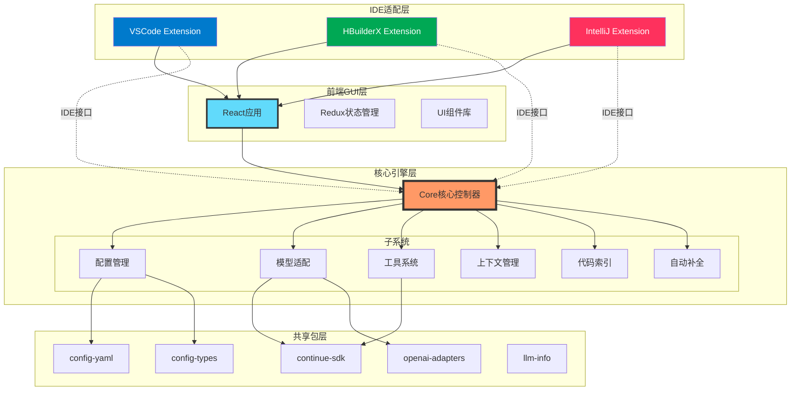
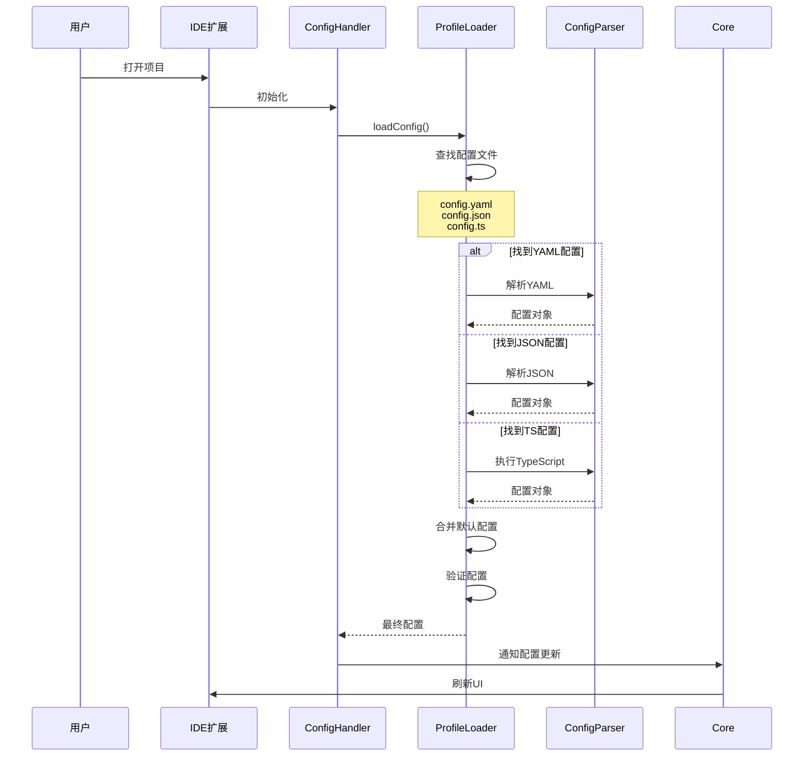
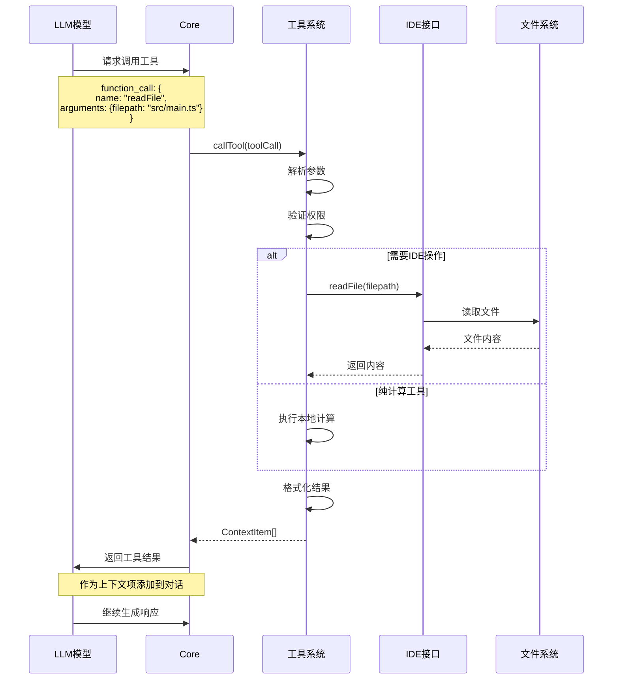
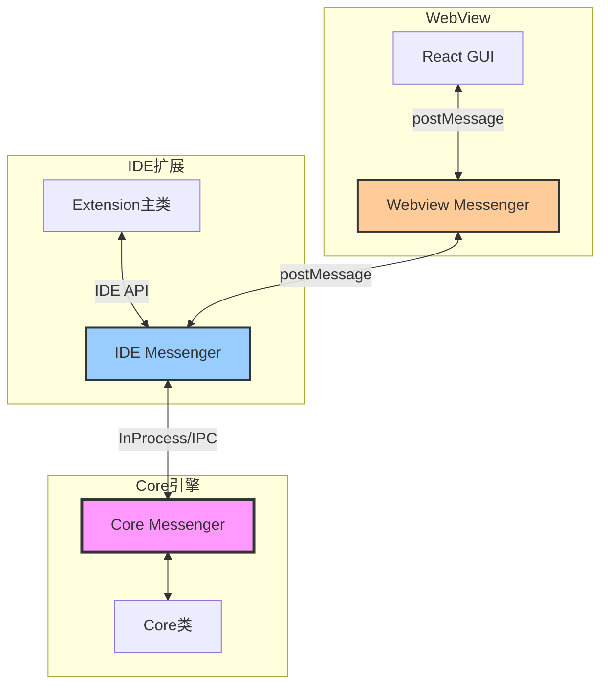
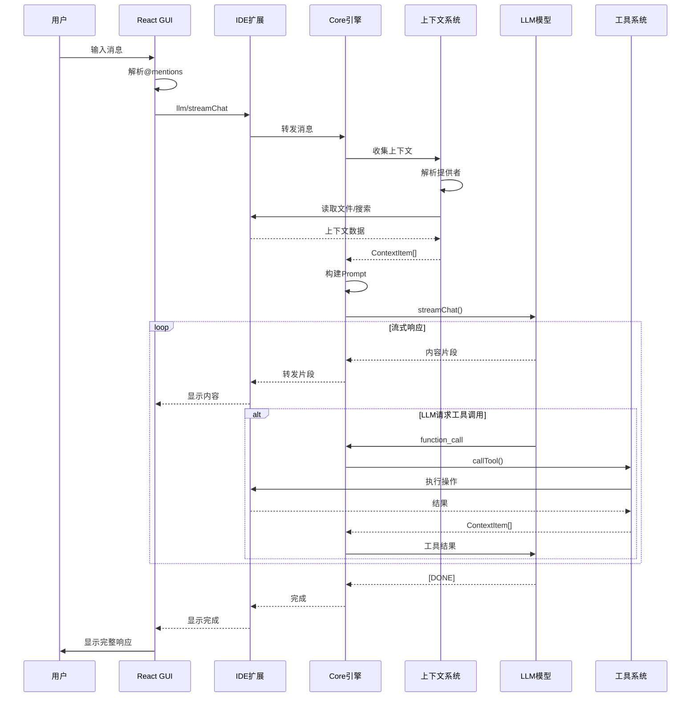
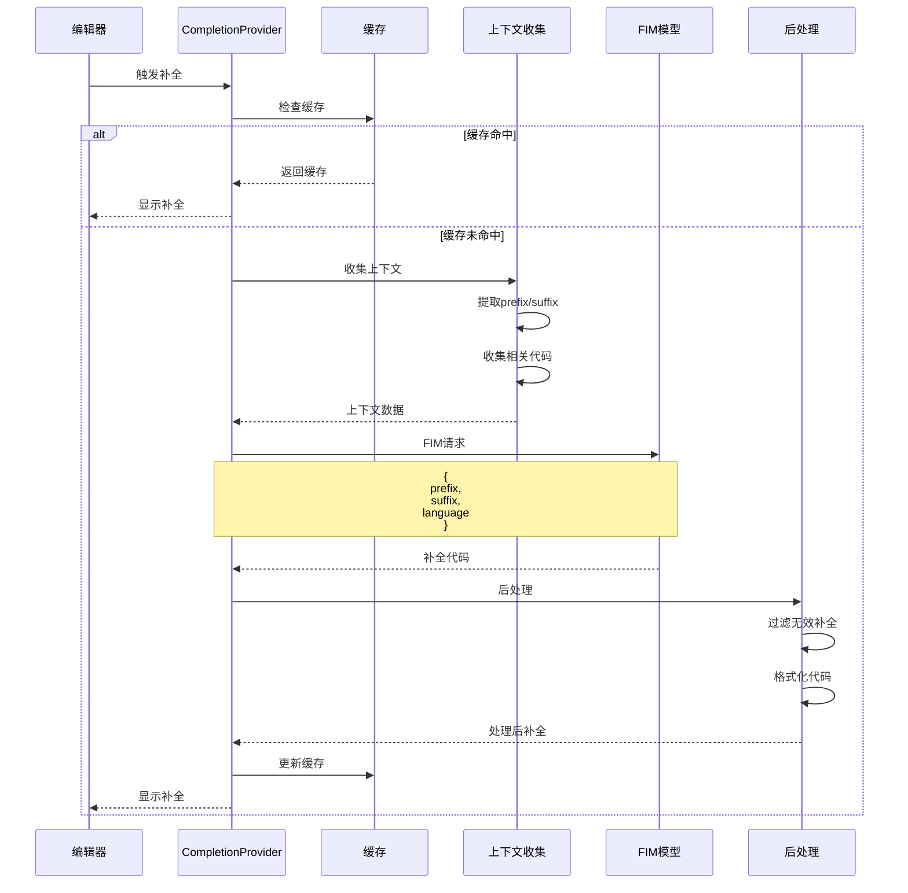
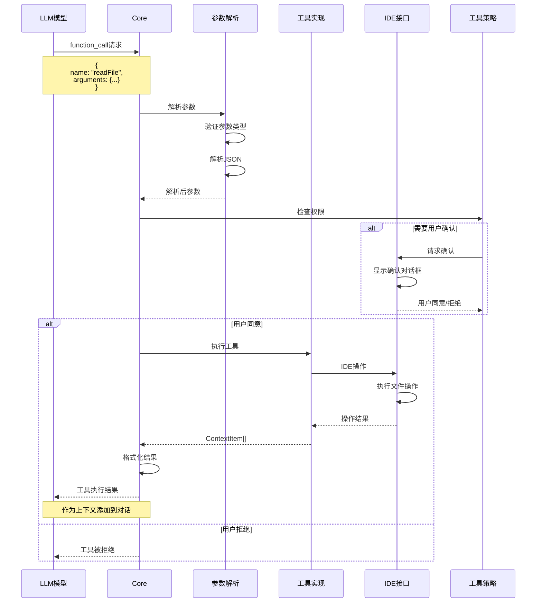
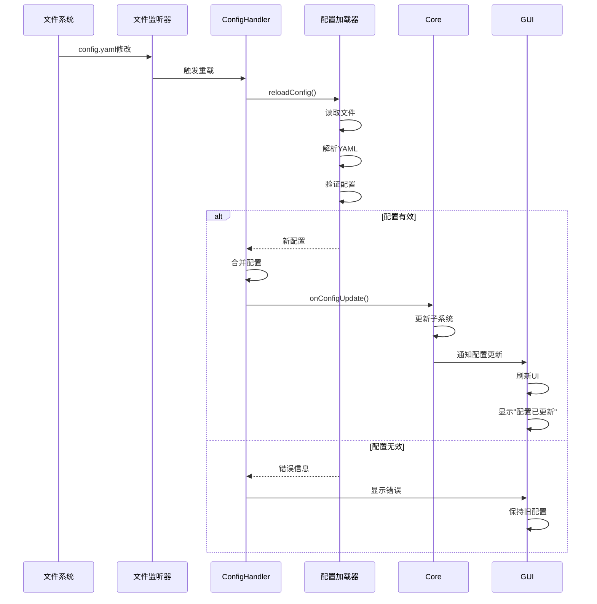

# Continue 项目架构深度分析

## 概述

Continue是一个开源的AI编程助手项目，旨在为多种IDE（VSCode、IntelliJ IDEA、HBuilderX等）提供统一的AI辅助编程能力。本文档基于最新代码，深入分析Continue的架构设计、核心模块、关键原理和实现细节。

## 目录

1. [整体架构](#整体架构)
2. [核心模块详解](#核心模块详解)
3. [通信协议](#通信协议)
4. [关键流程](#关键流程)
5. [扩展性设计](#扩展性设计)
6. [性能优化](#性能优化)
7. [总结](#总结)

## 整体架构

### 四层架构设计

Continue采用典型的分层架构，从上到下分为四层：


```mermaid
graph TB
    subgraph "IDE适配层"
        VSCode[VSCode Extension]
        HBuilderX[HBuilderX Extension]
        IntelliJ[IntelliJ Extension]
    end

    subgraph "前端GUI层"
        React[React应用]
        Redux[Redux状态管理]
        Components[UI组件库]
    end

    subgraph "核心引擎层"
        Core[Core核心控制器]

        subgraph "子系统"
            Config[配置管理]
            LLM[模型适配]
            Tools[工具系统]
            Context[上下文管理]
            Indexing[代码索引]
            Autocomplete[自动补全]
        end
    end

    subgraph "共享包层"
        ConfigYAML[config-yaml]
        ConfigTypes[config-types]
        SDK[continue-sdk]
        OpenAI[openai-adapters]
        LLMInfo[llm-info]
    end

    VSCode --> React
    HBuilderX --> React
    IntelliJ --> React

    React --> Core
    VSCode -.IDE接口.-> Core
    HBuilderX -.IDE接口.-> Core
    IntelliJ -.IDE接口.-> Core

    Core --> Config
    Core --> LLM
    Core --> Tools
    Core --> Context
    Core --> Indexing
    Core --> Autocomplete

    Config --> ConfigYAML
    Config --> ConfigTypes
    LLM --> SDK
    LLM --> OpenAI
    Tools --> SDK

    style Core fill:#f96,stroke:#333,stroke-width:4px
    style React fill:#61dafb,stroke:#333,stroke-width:3px
    style VSCode fill:#007acc,color:#fff
    style HBuilderX fill:#00a854,color:#fff
    style IntelliJ fill:#fe315d,color:#fff
```

### 核心设计理念

1. **IDE无关性**：通过统一的IDE接口（`IDE interface`）抽象各IDE差异
2. **模型无关性**：通过统一的LLM接口（`ILLM interface`）支持多种AI模型
3. **可扩展性**：插件化的工具系统、上下文提供者、配置加载器
4. **异步通信**：基于消息传递的松耦合架构
5. **类型安全**：使用TypeScript强类型和协议定义确保类型安全

### 目录结构

```
continue/
├── core/                           # 核心引擎（TypeScript）
│   ├── core.ts                     # Core主类，协调各子系统
│   ├── autocomplete/               # 代码自动补全系统
│   ├── config/                     # 配置管理系统
│   ├── context/                    # 上下文管理系统
│   ├── llm/                        # LLM模型适配层
│   ├── tools/                      # 工具系统
│   ├── indexing/                   # 代码索引系统
│   ├── protocol/                   # 通信协议定义
│   ├── util/                       # 工具函数
│   └── index.d.ts                  # TypeScript类型定义
├── extensions/                     # IDE扩展实现
│   ├── vscode/                     # VSCode扩展
│   ├── hbuilderx/                  # HBuilderX扩展
│   └── intellij/                   # IntelliJ扩展
├── gui/                            # React前端应用
│   ├── src/
│   │   ├── components/             # UI组件
│   │   ├── redux/                  # Redux状态管理
│   │   ├── context/                # React Context
│   │   ├── hooks/                  # 自定义Hooks
│   │   └── pages/                  # 页面组件
│   └── dist-hbuilderx/            # HBuilderX构建产物
├── packages/                       # 共享npm包
│   ├── config-yaml/                # YAML配置解析
│   ├── config-types/               # 配置类型定义
│   ├── continue-sdk/               # SDK
│   ├── openai-adapters/            # OpenAI适配器
│   └── llm-info/                   # LLM模型信息
└── binary/                         # 二进制可执行文件（CLI）
```

## 核心模块详解

### 1. Core核心控制器

**职责：**

- 协调各子系统
- 处理来自IDE和GUI的消息
- 管理生命周期
- 提供统一的API入口

**核心类结构：**

```typescript
export class Core {
  // 子系统
  configHandler: ConfigHandler;
  codeBaseIndexer: CodebaseIndexer;
  completionProvider: CompletionProvider;
  docsService: DocsService;

  // 通信
  private readonly messenger: IMessenger<ToCoreProtocol, FromCoreProtocol>;
  private readonly ide: IDE;

  // 状态管理
  private readonly abortedMessageIds: Set<string>;
  private readonly globalContext: GlobalContext;

  constructor(
    messenger: IMessenger<ToCoreProtocol, FromCoreProtocol>,
    ide: IDE,
  ) {
    // 初始化各子系统
    this.configHandler = new ConfigHandler(ide, ...);
    this.docsService = DocsService.createSingleton(...);
    this.codeBaseIndexer = new CodebaseIndexer(...);
    this.completionProvider = new CompletionProvider(...);

    // 绑定消息处理器
    this.messenger.onMessage((messageType, data) => {
      return this.handleMessage(messageType, data);
    });
  }

  // 消息处理入口
  private async handleMessage(
    messageType: keyof ToCoreProtocol,
    data: any
  ): Promise<any> {
    // 根据消息类型分发到不同处理函数
    switch (messageType) {
      case "llm/streamChat":
        return this.handleStreamChat(data);
      case "tools/call":
        return this.handleToolCall(data);
      case "config/reload":
        return this.configHandler.reloadConfig();
      // ... 更多消息类型
    }
  }
}
```

**关键方法：**

| 方法               | 功能         | 说明                     |
| ------------------ | ------------ | ------------------------ |
| `handleStreamChat` | 处理流式聊天 | 与LLM交互，流式返回响应  |
| `handleToolCall`   | 处理工具调用 | 执行AI请求的工具操作     |
| `invoke`           | 调用Core方法 | 通过消息系统调用Core功能 |
| `send`             | 发送消息     | 向IDE或GUI发送消息       |

### 2. 配置管理系统

**职责：**

- 加载和解析配置文件（YAML/JSON/TypeScript）
- 管理多配置文件（Profiles）
- 监听配置变化
- 验证配置有效性

**配置加载流程：**


```mermaid
sequenceDiagram
    participant User as 用户
    participant IDE as IDE扩展
    participant ConfigHandler as ConfigHandler
    participant Loader as ProfileLoader
    participant Parser as ConfigParser
    participant Core as Core

    User->>IDE: 打开项目
    IDE->>ConfigHandler: 初始化
    ConfigHandler->>Loader: loadConfig()

    Loader->>Loader: 查找配置文件
    Note over Loader: config.yaml<br/>config.json<br/>config.ts

    alt 找到YAML配置
        Loader->>Parser: 解析YAML
        Parser-->>Loader: 配置对象
    else 找到JSON配置
        Loader->>Parser: 解析JSON
        Parser-->>Loader: 配置对象
    else 找到TS配置
        Loader->>Parser: 执行TypeScript
        Parser-->>Loader: 配置对象
    end

    Loader->>Loader: 合并默认配置
    Loader->>Loader: 验证配置
    Loader-->>ConfigHandler: 最终配置

    ConfigHandler->>Core: 通知配置更新
    Core->>IDE: 刷新UI
```

**配置文件结构：**

```yaml
# config.yaml
models:
  - title: GPT-4
    provider: openai
    model: gpt-4
    apiKey: ${OPENAI_API_KEY}

  - title: Claude 3
    provider: anthropic
    model: claude-3-opus-20240229
    apiKey: ${ANTHROPIC_API_KEY}

selectedModelByRole:
  chat: GPT-4
  edit: Claude 3
  autocomplete: null

rules:
  - 总是使用TypeScript
  - 遵循项目代码风格

contextProviders:
  - name: code
    params:
      includeOpen: true
  - name: codebase
  - name: docs

tools:
  - name: searchFiles
    description: 搜索文件内容
  - name: readFile
    description: 读取文件内容
  - name: runCommand
    description: 执行终端命令

disableIndexing: false
```

### 3. LLM模型适配层

**职责：**

- 统一不同AI模型的接口
- 流式响应处理
- Token计数和限制
- 错误重试和降级

**ILLM接口定义：**

```typescript
export interface ILLM {
  // 基本信息
  title: string;
  provider: string;
  model: string;

  // 能力标识
  supportsImages?: boolean;
  supportsFim?: boolean; // Fill-in-the-middle
  supportsCompletions?: boolean;

  // 核心方法
  streamChat(
    messages: ChatMessage[],
    options: LLMFullCompletionOptions,
  ): AsyncGenerator<ChatMessage>;

  streamComplete(
    prompt: string,
    options: LLMFullCompletionOptions,
  ): AsyncGenerator<string>;

  complete(prompt: string, options: LLMFullCompletionOptions): Promise<string>;

  countTokens(text: string): number;

  // 可选：工具调用支持
  supportToolCalling?: boolean;
}
```

**已支持的模型提供商：**

| Provider        | 实现类                     | 特性                   |
| --------------- | -------------------------- | ---------------------- |
| OpenAI          | `OpenAI`                   | 支持函数调用、视觉模型 |
| Anthropic       | `Anthropic`                | Claude系列，长上下文   |
| Ollama          | `Ollama`                   | 本地运行，开源模型     |
| Google          | `Gemini`                   | Gemini系列             |
| Azure           | `AzureOpenAI`              | 企业部署               |
| HuggingFace     | `HuggingFace`              | 开源模型托管           |
| Transformers.js | `TransformersJsEmbeddings` | 浏览器内嵌入模型       |

**流式响应实现：**

```typescript
async *streamChat(
  messages: ChatMessage[],
  options: LLMFullCompletionOptions,
): AsyncGenerator<ChatMessage> {
  const response = await fetch(this.apiBase, {
    method: "POST",
    headers: {
      "Content-Type": "application/json",
      "Authorization": `Bearer ${this.apiKey}`,
    },
    body: JSON.stringify({
      model: this.model,
      messages,
      stream: true,
    }),
  });

  const reader = response.body.getReader();
  const decoder = new TextDecoder();
  let buffer = "";

  while (true) {
    const { done, value } = await reader.read();
    if (done) break;

    buffer += decoder.decode(value, { stream: true });
    const lines = buffer.split("\n");
    buffer = lines.pop() || "";

    for (const line of lines) {
      if (line.startsWith("data: ")) {
        const data = line.slice(6);
        if (data === "[DONE]") continue;

        const parsed = JSON.parse(data);
        const delta = parsed.choices[0].delta;

        if (delta.content) {
          yield {
            role: "assistant",
            content: delta.content,
          };
        }
      }
    }
  }
}
```

### 4. 工具系统

**职责：**

- 提供AI可调用的工具集
- 解析工具调用参数
- 执行工具并返回结果
- 管理工具权限和策略

**内置工具列表：**

| 工具名               | 功能           | 参数              |
| -------------------- | -------------- | ----------------- |
| `searchFiles`        | 搜索文件内容   | query, maxResults |
| `readFile`           | 读取文件内容   | filepath          |
| `readMultipleFiles`  | 批量读取文件   | filepaths[]       |
| `writeFile`          | 写入文件       | filepath, content |
| `editFile`           | 编辑文件       | filepath, edits[] |
| `runCommand`         | 执行终端命令   | command, cwd      |
| `viewCodeDefinition` | 查看代码定义   | symbol, filepath  |
| `searchCodebase`     | 语义搜索代码库 | query, maxResults |
| `viewDiff`           | 查看Git差异    | filepath          |
| `listDir`            | 列出目录内容   | dirpath           |

**工具调用流程：**


```mermaid
sequenceDiagram
    participant LLM as LLM模型
    participant Core as Core
    participant Tools as 工具系统
    participant IDE as IDE接口
    participant FS as 文件系统

    LLM->>Core: 请求调用工具
    Note over LLM,Core: function_call: {<br/>  name: "readFile",<br/>  arguments: {filepath: "src/main.ts"}<br/>}

    Core->>Tools: callTool(toolCall)
    Tools->>Tools: 解析参数
    Tools->>Tools: 验证权限

    alt 需要IDE操作
        Tools->>IDE: readFile(filepath)
        IDE->>FS: 读取文件
        FS-->>IDE: 文件内容
        IDE-->>Tools: 返回内容
    else 纯计算工具
        Tools->>Tools: 执行本地计算
    end

    Tools->>Tools: 格式化结果
    Tools-->>Core: ContextItem[]

    Core->>LLM: 返回工具结果
    Note over Core,LLM: 作为上下文项添加到对话

    LLM->>Core: 继续生成响应
```

**工具实现示例：**

```typescript
// core/tools/implementations/readFile.ts
export const readFileImpl: ToolImpl = async (args, extras) => {
  console.log("[hbuilderx] readFileImpl: Starting", {
    args,
    toolCallId: extras.toolCallId,
  });

  try {
    const filepath = getStringArg(args, "filepath");

    // 解析路径
    const resolvedPath = await resolveInputPath(extras.ide, filepath);
    if (!resolvedPath) {
      throw new ContinueError(
        ContinueErrorReason.PathNotFound,
        `No file ${filepath} found`,
      );
    }

    // 检查文件大小
    await throwIfFileExceedsHalfOfContext(
      resolvedPath.uri,
      extras.ide,
      extras.llm,
    );

    // 读取文件
    const content = await extras.ide.readFile(resolvedPath.uri);

    return [
      {
        name: resolvedPath.relPath || resolvedPath.path,
        description: filepath,
        content,
        uri: {
          type: "file",
          value: resolvedPath.uri,
        },
      },
    ];
  } catch (error) {
    console.error("[hbuilderx] readFileImpl: Failed", { error });
    throw error;
  }
};
```

### 5. 上下文管理系统

**职责：**

- 收集对话上下文
- 管理上下文提供者
- 控制上下文大小
- 优化上下文质量

**上下文提供者类型：**

```typescript
export interface IContextProvider {
  title: string;
  displayTitle?: string;
  description: string;
  type: ContextProviderType;

  getContextItems(
    query: string,
    extras: ContextProviderExtras,
  ): Promise<ContextItem[]>;

  loadSubmenuItems?(args: LoadSubmenuItemsArgs): Promise<ContextSubmenuItem[]>;
}
```

**内置上下文提供者：**

| 名称          | 类型   | 功能                     |
| ------------- | ------ | ------------------------ |
| `code`        | normal | 当前打开的文件和选中代码 |
| `codebase`    | query  | 语义搜索代码库           |
| `diff`        | normal | Git差异                  |
| `folder`      | query  | 指定文件夹的内容         |
| `tree`        | normal | 项目目录树               |
| `docs`        | query  | 文档搜索                 |
| `url`         | query  | 从URL抓取内容            |
| `terminal`    | normal | 终端输出                 |
| `problems`    | normal | 代码问题和错误           |
| `currentFile` | normal | 当前编辑的文件           |

**上下文收集流程：**

```mermaid
flowchart TD
    A[用户输入] --> B{解析@mentions}
    B -->|"@code"| C[收集打开的文件]
    B -->|"@codebase"| D[语义搜索]
    B -->|"@docs"| E[搜索文档]
    B -->|"@folder"| F[读取文件夹]
    B -->|"@url"| G[抓取网页]

    C --> H[合并上下文]
    D --> H
    E --> H
    F --> H
    G --> H

    H --> I[计算Token数]
    I -->|超出限制| J[压缩上下文]
    I -->|未超出| K[直接使用]

    J --> K
    K --> L[构建Prompt]
    L --> M[发送给LLM]
```

### 6. 代码索引系统

**职责：**

- 构建代码库索引
- 支持语义搜索
- 管理向量数据库
- 增量更新索引

**索引架构：**

```typescript
export class CodebaseIndexer {
  // 索引实现
  private lanceDbIndex: LanceDbIndex;
  private chunkIndex: ChunkCodebaseIndex;

  // 嵌入模型
  private embeddings: EmbeddingsProvider;

  async indexCodebase(dirs: string[]) {
    // 1. 扫描文件
    const files = await this.scanFiles(dirs);

    // 2. 分块
    const chunks = await this.chunkFiles(files);

    // 3. 生成嵌入向量
    const embeddings = await this.embeddings.embed(chunks);

    // 4. 存入向量数据库
    await this.lanceDbIndex.insert(chunks, embeddings);

    // 5. 更新元数据
    await this.updateMetadata();
  }

  async search(query: string, n: number = 10): Promise<Chunk[]> {
    // 1. 查询向量
    const queryEmbedding = await this.embeddings.embed([query]);

    // 2. 向量搜索
    const results = await this.lanceDbIndex.search(queryEmbedding[0], n);

    // 3. 重排序
    const reranked = await this.rerank(query, results);

    return reranked;
  }
}
```

**分块策略：**

| 策略     | 大小       | 重叠       | 适用场景 |
| -------- | ---------- | ---------- | -------- |
| 固定大小 | 512 tokens | 50 tokens  | 通用文本 |
| 语法树   | 函数/类    | 0          | 代码文件 |
| 段落     | 自然段     | 0          | 文档     |
| 滑动窗口 | 256 tokens | 128 tokens | 长文本   |

### 7. 自动补全系统

**职责：**

- 代码补全建议
- 上下文感知
- 性能优化（缓存、防抖）
- 多模型支持

**补全流程：**

```typescript
export class CompletionProvider {
  async provideInlineCompletionItems(
    document: TextDocument,
    position: Position,
    context: InlineCompletionContext,
  ): Promise<InlineCompletionItem[]> {
    // 1. 收集上下文
    const prefix = document.getText(
      new Range(new Position(position.line - 10, 0), position),
    );
    const suffix = document.getText(
      new Range(position, new Position(position.line + 10, 0)),
    );

    // 2. 检查缓存
    const cached = this.cache.get(prefix + suffix);
    if (cached) return [cached];

    // 3. 调用FIM模型
    const completion = await this.llm.streamFim({
      prefix,
      suffix,
      language: document.languageId,
    });

    // 4. 后处理
    const processed = await this.postprocess(completion, {
      prefix,
      suffix,
      language: document.languageId,
    });

    // 5. 缓存结果
    this.cache.set(prefix + suffix, processed);

    return [processed];
  }
}
```

## 通信协议

### 消息传递架构

Continue使用基于消息的异步通信架构，实现IDE、GUI和Core之间的解耦：


```mermaid
graph TB
    subgraph "IDE扩展"
        IdeExtension[Extension主类]
        IdeMessenger[IDE Messenger]
    end

    subgraph "WebView"
        GUI[React GUI]
        WebviewMessenger[Webview Messenger]
    end

    subgraph "Core引擎"
        CoreClass[Core类]
        CoreMessenger[Core Messenger]
    end

    IdeExtension <-->|IDE API| IdeMessenger
    GUI <-->|postMessage| WebviewMessenger

    IdeMessenger <-->|InProcess/IPC| CoreMessenger
    WebviewMessenger <-->|postMessage| IdeMessenger

    CoreMessenger <--> CoreClass

    style CoreMessenger fill:#f9f,stroke:#333,stroke-width:3px
    style IdeMessenger fill:#9cf,stroke:#333,stroke-width:2px
    style WebviewMessenger fill:#fc9,stroke:#333,stroke-width:2px
```

### 协议定义

**核心协议类型：**

```typescript
// IDE -> Core
export type ToCoreFromIdeProtocol = {
  // IDE信息
  getIdeInfo: [undefined, IdeInfo];
  getIdeSettings: [undefined, IdeSettings];

  // 文件操作
  readFile: [{ filepath: string }, string];
  writeFile: [{ filepath: string; content: string }, void];

  // ... 更多消息类型
};

// Core -> IDE
export type ToIdeFromCoreProtocol = {
  // 通知
  showToast: [{ type: ToastType; message: string }, void];
  setFileOpen: [{ filepath: string }, void];

  // ... 更多消息类型
};

// GUI -> Core (通过IDE中转)
export type ToCoreFromWebviewProtocol = {
  // 聊天
  "llm/streamChat": [
    { messages: ChatMessage[]; options: CompletionOptions },
    AsyncGenerator<ChatMessage>,
  ];

  // 配置
  "config/reload": [undefined, void];

  // ... 更多消息类型
};

// Core -> GUI
export type ToWebviewFromCoreProtocol = {
  // 状态更新
  setInactive: [undefined, void];
  configUpdate: [{ config: ContinueConfig }, void];

  // ... 更多消息类型
};
```

### 消息传递实现

**InProcessMessenger（进程内）：**

```typescript
export class InProcessMessenger<TSend, TRecv>
  implements IMessenger<TSend, TRecv>
{
  private listeners = new Map<string, MessageHandler[]>();

  send<T extends keyof TSend>(
    messageType: T,
    data: TSend[T][0],
  ): Promise<TSend[T][1]> {
    const handlers = this.listeners.get(messageType as string) || [];

    for (const handler of handlers) {
      const result = handler(data);
      if (result !== undefined) {
        return Promise.resolve(result);
      }
    }

    return Promise.reject(new Error(`No handler for ${messageType}`));
  }

  on<T extends keyof TRecv>(
    messageType: T,
    handler: (data: TRecv[T][0]) => TRecv[T][1] | Promise<TRecv[T][1]>,
  ): void {
    if (!this.listeners.has(messageType as string)) {
      this.listeners.set(messageType as string, []);
    }
    this.listeners.get(messageType as string)!.push(handler);
  }
}
```

**HBuilderX WebView消息传递：**

```typescript
// 扩展侧
export class HbuilderXWebviewProtocol {
  onWebviewMessage(callback: (data: any) => void) {
    if (!this._webview) {
      console.warn("[hbuilderx] WebView not initialized");
      return;
    }

    this._webview.onDidReceiveMessage((data: any) => {
      console.log("[hbuilderx] 从WebView收到消息:", data.messageType);
      callback(data);
    });
  }

  async sendMessageToWebview(
    messageType: string,
    data: any,
    messageId?: string,
  ): Promise<any> {
    const message = {
      messageId: messageId ?? uuidv4(),
      messageType,
      data,
    };

    console.log("[hbuilderx] 向WebView发送消息:", messageType);
    this._webview.postMessage(message);
  }
}

// GUI侧
export class IdeMessenger {
  post(messageType: string, data: any, messageId?: string): void {
    if (isHBuilderX()) {
      const msg = { messageId, messageType, data };
      hbuilderx.postMessage(msg);
    } else {
      vscode.postMessage({ messageId, messageType, data });
    }
  }

  request(messageType: string, data: any): Promise<any> {
    const messageId = uuidv4();

    return new Promise((resolve) => {
      if (isHBuilderX()) {
        const handler = (msg: any) => {
          if (msg.messageId === messageId) {
            resolve(msg.data);
          }
        };
        hbuilderx.onDidReceiveMessage(handler);
      } else {
        const handler = (event: any) => {
          if (event.data.messageId === messageId) {
            window.removeEventListener("message", handler);
            resolve(event.data.data);
          }
        };
        window.addEventListener("message", handler);
      }

      this.post(messageType, data, messageId);
    });
  }
}
```

## 关键流程

### 1. 聊天对话流程


```mermaid
sequenceDiagram
    participant User as 用户
    participant GUI as React GUI
    participant IDE as IDE扩展
    participant Core as Core引擎
    participant Context as 上下文系统
    participant LLM as LLM模型
    participant Tools as 工具系统

    User->>GUI: 输入消息
    GUI->>GUI: 解析@mentions
    GUI->>IDE: llm/streamChat
    IDE->>Core: 转发消息

    Core->>Context: 收集上下文
    Context->>Context: 解析提供者
    Context->>IDE: 读取文件/搜索
    IDE-->>Context: 上下文数据
    Context-->>Core: ContextItem[]

    Core->>Core: 构建Prompt
    Core->>LLM: streamChat()

    loop 流式响应
        LLM-->>Core: 内容片段
        Core-->>IDE: 转发片段
        IDE-->>GUI: 显示内容

        alt LLM请求工具调用
            LLM->>Core: function_call
            Core->>Tools: callTool()
            Tools->>IDE: 执行操作
            IDE-->>Tools: 结果
            Tools-->>Core: ContextItem[]
            Core->>LLM: 工具结果
        end
    end

    LLM-->>Core: [DONE]
    Core-->>IDE: 完成
    IDE-->>GUI: 显示完成
    GUI->>User: 显示完整响应
```

### 2. 代码补全流程


```mermaid
sequenceDiagram
    participant Editor as 编辑器
    participant Provider as CompletionProvider
    participant Cache as 缓存
    participant Context as 上下文收集
    participant LLM as FIM模型
    participant Post as 后处理

    Editor->>Provider: 触发补全
    Provider->>Cache: 检查缓存

    alt 缓存命中
        Cache-->>Provider: 返回缓存
        Provider-->>Editor: 显示补全
    else 缓存未命中
        Provider->>Context: 收集上下文
        Context->>Context: 提取prefix/suffix
        Context->>Context: 收集相关代码
        Context-->>Provider: 上下文数据

        Provider->>LLM: FIM请求
        Note over Provider,LLM: {<br/>  prefix,<br/>  suffix,<br/>  language<br/>}

        LLM-->>Provider: 补全代码

        Provider->>Post: 后处理
        Post->>Post: 过滤无效补全
        Post->>Post: 格式化代码
        Post-->>Provider: 处理后补全

        Provider->>Cache: 更新缓存
        Provider-->>Editor: 显示补全
    end
```

### 3. 工具调用流程


```mermaid
sequenceDiagram
    participant LLM as LLM模型
    participant Core as Core
    participant Parser as 参数解析
    participant Tool as 工具实现
    participant IDE as IDE接口
    participant Policy as 工具策略

    LLM->>Core: function_call请求
    Note over LLM,Core: {<br/>  name: "readFile",<br/>  arguments: {...}<br/>}

    Core->>Parser: 解析参数
    Parser->>Parser: 验证参数类型
    Parser->>Parser: 解析JSON
    Parser-->>Core: 解析后参数

    Core->>Policy: 检查权限

    alt 需要用户确认
        Policy->>IDE: 请求确认
        IDE->>IDE: 显示确认对话框
        IDE-->>Policy: 用户同意/拒绝
    end

    alt 用户同意
        Core->>Tool: 执行工具
        Tool->>IDE: IDE操作
        IDE->>IDE: 执行文件操作
        IDE-->>Tool: 操作结果
        Tool-->>Core: ContextItem[]

        Core->>Core: 格式化结果
        Core-->>LLM: 工具执行结果
        Note over Core,LLM: 作为上下文添加到对话
    else 用户拒绝
        Core-->>LLM: 工具被拒绝
    end
```

### 4. 配置热重载流程


```mermaid
sequenceDiagram
    participant FS as 文件系统
    participant Watcher as 文件监听器
    participant ConfigHandler as ConfigHandler
    participant Loader as 配置加载器
    participant Core as Core
    participant GUI as GUI

    FS->>Watcher: config.yaml修改
    Watcher->>ConfigHandler: 触发重载

    ConfigHandler->>Loader: reloadConfig()
    Loader->>Loader: 读取文件
    Loader->>Loader: 解析YAML
    Loader->>Loader: 验证配置

    alt 配置有效
        Loader-->>ConfigHandler: 新配置
        ConfigHandler->>ConfigHandler: 合并配置
        ConfigHandler->>Core: onConfigUpdate()

        Core->>Core: 更新子系统
        Core->>GUI: 通知配置更新
        GUI->>GUI: 刷新UI
        GUI->>GUI: 显示"配置已更新"
    else 配置无效
        Loader-->>ConfigHandler: 错误信息
        ConfigHandler->>GUI: 显示错误
        GUI->>GUI: 保持旧配置
    end
```

## 扩展性设计

### 1. 插件化工具系统

**添加新工具的步骤：**

```typescript
// 1. 定义工具接口
export const myCustomTool: ToolDefinition = {
  function: {
    name: "myCustomTool",
    description: "My custom tool description",
    parameters: {
      type: "object",
      properties: {
        param1: {
          type: "string",
          description: "Parameter 1",
        },
      },
      required: ["param1"],
    },
  },
};

// 2. 实现工具逻辑
export const myCustomToolImpl: ToolImpl = async (args, extras) => {
  const param1 = getStringArg(args, "param1");

  // 执行工具逻辑
  const result = await doSomething(param1, extras.ide);

  // 返回上下文项
  return [
    {
      name: "Custom Tool Result",
      description: "Result from my custom tool",
      content: result,
    },
  ];
};

// 3. 注册工具
export function registerTools() {
  BuiltInTools.push({
    definition: myCustomTool,
    implementation: myCustomToolImpl,
  });
}
```

### 2. 自定义上下文提供者

```typescript
// 创建自定义上下文提供者
export class MyContextProvider implements IContextProvider {
  title = "myProvider";
  displayTitle = "My Provider";
  description = "My custom context provider";
  type = "query" as ContextProviderType;

  async getContextItems(
    query: string,
    extras: ContextProviderExtras,
  ): Promise<ContextItem[]> {
    // 实现获取上下文逻辑
    const data = await fetchData(query);

    return [
      {
        name: "My Context",
        description: query,
        content: data,
      },
    ];
  }
}

// 在配置中使用
// config.yaml
contextProviders:
  - name: myProvider
    params:
      customParam: value
```

### 3. 自定义LLM提供者

```typescript
export class MyLLMProvider extends BaseLLM {
  static providerName = "myProvider";

  constructor(options: ModelOptions) {
    super(options);
  }

  async *streamChat(
    messages: ChatMessage[],
    options: LLMFullCompletionOptions,
  ): AsyncGenerator<ChatMessage> {
    // 实现流式聊天
    const response = await this.fetchStream(messages, options);

    for await (const chunk of response) {
      yield {
        role: "assistant",
        content: chunk.text,
      };
    }
  }

  async *streamComplete(
    prompt: string,
    options: LLMFullCompletionOptions,
  ): AsyncGenerator<string> {
    // 实现流式补全
    const response = await this.fetchStream([
      { role: "user", content: prompt }
    ], options);

    for await (const chunk of response) {
      yield chunk.text;
    }
  }
}

// 在配置中使用
// config.yaml
models:
  - title: My Model
    provider: myProvider
    model: my-model-name
    apiKey: ${MY_API_KEY}
    apiBase: https://api.example.com
```

## 性能优化

### 1. 缓存策略

**多级缓存：**

```typescript
// Level 1: 内存缓存
class MemoryCache<T> {
  private cache = new Map<string, T>();
  private maxSize = 100;

  get(key: string): T | undefined {
    return this.cache.get(key);
  }

  set(key: string, value: T): void {
    if (this.cache.size >= this.maxSize) {
      const firstKey = this.cache.keys().next().value;
      this.cache.delete(firstKey);
    }
    this.cache.set(key, value);
  }
}

// Level 2: LRU缓存
class LRUCache<T> {
  private cache = new Map<string, { value: T; timestamp: number }>();
  private maxAge = 5 * 60 * 1000; // 5分钟

  get(key: string): T | undefined {
    const item = this.cache.get(key);
    if (!item) return undefined;

    if (Date.now() - item.timestamp > this.maxAge) {
      this.cache.delete(key);
      return undefined;
    }

    return item.value;
  }
}

// Level 3: 磁盘缓存
class DiskCache<T> {
  async get(key: string): Promise<T | undefined> {
    const filepath = this.getCachePath(key);
    if (!(await fs.promises.exists(filepath))) {
      return undefined;
    }

    const data = await fs.promises.readFile(filepath, "utf-8");
    return JSON.parse(data);
  }
}
```

### 2. 防抖和节流

**补全防抖：**

```typescript
export class CompletionDebouncer {
  private timeout: NodeJS.Timeout | null = null;
  private delay = 300; // ms

  debounce(fn: () => void): void {
    if (this.timeout) {
      clearTimeout(this.timeout);
    }

    this.timeout = setTimeout(() => {
      fn();
      this.timeout = null;
    }, this.delay);
  }

  cancel(): void {
    if (this.timeout) {
      clearTimeout(this.timeout);
      this.timeout = null;
    }
  }
}
```

### 3. 懒加载

**按需加载模型：**

```typescript
export class LazyLLMLoader {
  private loadedModels = new Map<string, ILLM>();

  async getModel(modelId: string): Promise<ILLM> {
    // 检查是否已加载
    if (this.loadedModels.has(modelId)) {
      return this.loadedModels.get(modelId)!;
    }

    // 动态加载模型
    const modelClass = await this.loadModelClass(modelId);
    const model = new modelClass(this.getModelOptions(modelId));

    this.loadedModels.set(modelId, model);
    return model;
  }

  private async loadModelClass(modelId: string): Promise<any> {
    // 根据modelId动态import对应的类
    switch (modelId) {
      case "openai":
        return (await import("./llms/OpenAI")).default;
      case "anthropic":
        return (await import("./llms/Anthropic")).default;
      // ... 更多模型
    }
  }
}
```

### 4. 流式处理

**大文件流式读取：**

```typescript
async function* streamLargeFile(
  filepath: string,
  chunkSize: number = 4096,
): AsyncGenerator<string> {
  const stream = fs.createReadStream(filepath, {
    encoding: "utf-8",
    highWaterMark: chunkSize,
  });

  for await (const chunk of stream) {
    yield chunk;
  }
}

// 使用
for await (const chunk of streamLargeFile("large-file.txt")) {
  await processChunk(chunk);
}
```

### 5. 增量更新

**代码索引增量更新：**

```typescript
export class IncrementalIndexer {
  async updateIndex(changedFiles: string[]): Promise<void> {
    // 1. 删除旧索引
    await this.deleteIndexEntries(changedFiles);

    // 2. 重新索引修改的文件
    for (const file of changedFiles) {
      const chunks = await this.chunkFile(file);
      const embeddings = await this.embedChunks(chunks);
      await this.insertIndexEntries(chunks, embeddings);
    }

    // 3. 更新元数据
    await this.updateMetadata(changedFiles);
  }
}
```

## 总结

Continue是一个设计精良、架构清晰的AI编程助手项目，具有以下特点：

### 核心优势

1. **模块化设计**：清晰的分层架构，各模块职责明确
2. **IDE无关性**：统一的IDE接口，支持多IDE适配
3. **模型无关性**：统一的LLM接口，支持多种AI模型
4. **可扩展性**：插件化的工具、上下文提供者、配置加载器
5. **类型安全**：完整的TypeScript类型定义和协议规范
6. **异步通信**：基于消息传递的松耦合架构
7. **性能优化**：多级缓存、懒加载、流式处理

### 技术栈

- **语言**：TypeScript (core/extensions)、TSX (GUI)
- **框架**：React 18 (GUI)、Redux Toolkit (状态管理)
- **构建**：esbuild (extensions)、Vite (GUI)
- **通信**：消息传递、异步生成器、流式响应
- **存储**：SQLite (历史)、LanceDB (向量数据库)

### 适配要点

对于IDE适配（如HBuilderX），需要关注：

1. **IDE接口实现**：实现IDE interface的所有方法
2. **消息通信**：适配WebView消息传递机制
3. **日志系统**：统一的日志前缀和格式
4. **Polyfills**：添加必要的兼容层
5. **构建配置**：针对目标IDE的特殊构建配置

通过深入理解Continue的架构设计和实现原理，可以更好地进行IDE适配、功能扩展和性能优化。
