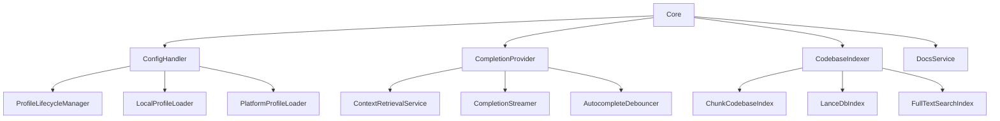

# Continue Core模块设计文档

## 概述

Continue的core模块是整个AI编程助手的核心引擎，提供了自动补全、聊天对话、代码分析、工具调用等核心功能。本文档深入分析core模块的架构设计、关键实现原理和核心算法。

## 核心架构

### 主要组件

core模块采用模块化设计，主要包含以下核心组件：

```
core/
├── Core类 (core.ts) - 核心控制器，协调各模块
├── 自动补全系统 (autocomplete/) - 代码自动补全
├── 配置管理 (config/) - 配置文件处理和管理
├── 上下文系统 (context/) - 上下文提供者和检索
├── LLM接口 (llm/) - 大语言模型集成
├── 工具系统 (tools/) - 内置工具和扩展
├── 索引系统 (indexing/) - 代码库索引和搜索
├── 命令系统 (commands/) - 斜杠命令处理
├── 协议定义 (protocol/) - 通信协议
└── 工具函数 (util/) - 通用工具函数
```

### 核心类关系



## 详细模块分析

### 1. Core控制器 (core.ts)

**设计目标**：

- 统一的消息处理和分发
- 各子模块的生命周期管理
- IDE和WebView之间的通信桥梁

**关键实现**：

```typescript
class Core {
  // 消息中断控制器，支持取消长时间运行的操作
  private messageAbortControllers = new Map<string, AbortController>();

  // 添加可中断的消息处理
  private addMessageAbortController(id: string): AbortController {
    const controller = new AbortController();
    this.messageAbortControllers.set(id, controller);
    controller.signal.addEventListener("abort", () => {
      this.messageAbortControllers.delete(id);
    });
    return controller;
  }

  // 同步调用其他模块
  invoke<T extends keyof ToCoreProtocol>(
    messageType: T,
    data: ToCoreProtocol[T][0],
  );

  // 异步发送到IDE/WebView
  send<T extends keyof FromCoreProtocol>(
    messageType: T,
    data: FromCoreProtocol[T][0],
  );
}
```

**设计模式应用**：

- **观察者模式** - 配置更新时通知所有模块
- **策略模式** - 不同消息类型使用不同处理策略
- **中介者模式** - Core作为各模块间的通信中介

### 2. 自动补全系统 (autocomplete/)

**架构设计**：

```
autocomplete/
├── CompletionProvider.ts - 主补全提供者，协调整个补全流程
├── classification/ - 补全分类（单行/多行）
├── context/ - 上下文检索服务
├── filtering/ - 补全过滤器（括号匹配等）
├── generation/ - 补全生成器
├── postprocessing/ - 后处理（去重、格式化）
├── prefiltering/ - 预过滤（避免不必要的LLM调用）
├── snippets/ - 代码片段收集
├── templating/ - 提示词模板渲染
└── util/ - 工具函数（缓存、防抖等）
```

**核心流程设计**：

```typescript
class CompletionProvider {
  async provideInlineCompletionItems(
    input: AutocompleteInput,
    token: AbortSignal,
  ) {
    // 1. 预过滤 - 快速判断是否需要补全
    if (await shouldPrefilter(helper, this.ide)) {
      return undefined;
    }

    // 2. 上下文收集 - 并行收集相关信息
    const [snippetPayload, workspaceDirs] = await Promise.all([
      getAllSnippets({ helper, ide: this.ide }),
      this.ide.getWorkspaceDirs(),
    ]);

    // 3. 提示词渲染
    const { prompt, prefix, suffix } = renderPrompt({
      snippetPayload,
      workspaceDirs,
      helper,
    });

    // 4. 缓存检查
    const cachedCompletion = helper.options.useCache
      ? await cache.get(helper.prunedPrefix)
      : undefined;

    // 5. LLM调用（如果没有缓存）
    if (!cachedCompletion) {
      const completionStream = llm.streamFim(prefix, suffix, token);
      completion =
        await this.completionStreamer.streamCompletion(completionStream);
    }

    // 6. 后处理
    return postprocessCompletion(completion, helper);
  }
}
```

**关键算法 - 上下文检索**：

```typescript
class ContextRetrievalService {
  async getSnippets(helper: HelperVars): Promise<ContextItem[]> {
    const retrievalMethods = [
      () => this.getRecentlyEditedFiles(helper),
      () => this.getDefinitionsFromLsp(helper),
      () => this.getImportedModules(helper),
      () => this.getSimilarCodeSnippets(helper),
    ];

    // 并行执行多种检索策略
    const results = await Promise.allSettled(
      retrievalMethods.map((method) => method()),
    );

    // 合并和排序结果
    return this.mergeAndRankResults(results, helper);
  }
}
```

**防抖机制**：

```typescript
class AutocompleteDebouncer {
  private lastTriggerTime = 0;
  private debounceTimeout?: NodeJS.Timeout;

  async delayAndShouldDebounce(delay: number): Promise<boolean> {
    const now = Date.now();
    this.lastTriggerTime = now;

    return new Promise((resolve) => {
      clearTimeout(this.debounceTimeout);
      this.debounceTimeout = setTimeout(() => {
        // 只有在延迟期间没有新的触发才执行
        resolve(this.lastTriggerTime === now);
      }, delay);
    });
  }
}
```

### 3. 配置管理系统 (config/)

**设计理念**：

- 配置的层次化管理（工作区 > 全局 > 平台 > 默认）
- 配置的热重载和动态更新
- 多环境配置支持（本地、平台、企业）

**核心组件关系**：

```typescript
class ConfigHandler {
  // 组织管理
  private organizations: OrgWithProfiles[] = [];
  currentOrg: OrgWithProfiles;

  // 配置文件管理
  currentProfile: ProfileLifecycleManager | null;
  private globalLocalProfileManager: ProfileLifecycleManager;

  // 配置更新观察者
  private updateListeners: ConfigUpdateFunction[] = [];

  async loadConfig(): Promise<ConfigResult<ContinueConfig>> {
    // 1. 确定当前组织和配置文件
    const profile = this.currentProfile || this.globalLocalProfileManager;

    // 2. 加载配置
    const result = await profile.loadConfig();

    // 3. 合并默认配置
    const mergedConfig = this.mergeWithDefaults(result.config);

    // 4. 验证配置
    return this.validateConfig(mergedConfig);
  }
}
```

**配置合并策略**：

```typescript
// 配置合并规则
type ConfigMergeType = "merge" | "overwrite";

interface ContinueRcJson extends Partial<SerializedContinueConfig> {
  mergeBehavior: ConfigMergeType;
}

function mergeConfigs(base: Config, override: ContinueRcJson): Config {
  if (override.mergeBehavior === "overwrite") {
    return { ...base, ...override };
  }

  // 深度合并模式
  return deepMerge(base, override, {
    arrayMerge: (target, source) => source, // 数组替换策略
    customMerge: (key) => {
      if (key === "models") return "replace";
      if (key === "contextProviders") return "concat";
      return undefined;
    },
  });
}
```

### 4. 上下文系统 (context/)

**设计架构**：

```typescript
// 上下文提供者接口
interface IContextProvider {
  get description(): ContextProviderDescription;

  // 获取上下文项
  getContextItems(
    query: string,
    extras: ContextProviderExtras,
  ): Promise<ContextItem[]>;

  // 加载子菜单项（用于动态上下文）
  loadSubmenuItems(args: LoadSubmenuItemsArgs): Promise<ContextSubmenuItem[]>;
}
```

**上下文类型系统**：

```typescript
// 上下文提供者类型
type ContextProviderType = "normal" | "query" | "submenu";

interface ContextProviderDescription {
  title: string;
  displayTitle: string;
  description: string;
  type: ContextProviderType;
  dependsOnIndexing?: boolean; // 是否依赖索引系统
}
```

**关键实现 - 代码库上下文提供者**：

```typescript
class CodebaseContextProvider implements IContextProvider {
  async getContextItems(query: string, extras: ContextProviderExtras) {
    const { embeddingsProvider, reranker, llm } = extras;

    // 1. 向量搜索
    const chunks = await this.vectorSearch(query, embeddingsProvider);

    // 2. 重排序
    const rerankedChunks = reranker
      ? await reranker.rerank(query, chunks)
      : chunks;

    // 3. 转换为上下文项
    return rerankedChunks.map((chunk) => ({
      name: `${chunk.filepath}:${chunk.startLine}-${chunk.endLine}`,
      description: `Code from ${chunk.filepath}`,
      content: chunk.content,
      uri: { type: "file", value: chunk.filepath },
    }));
  }
}
```

### 5. LLM接口系统 (llm/)

**统一抽象设计**：

```typescript
interface ILLM {
  // 基本属性
  get providerName(): string;
  get underlyingProviderName(): string;

  // 核心功能
  streamChat(
    messages: ChatMessage[],
    signal: AbortSignal,
  ): AsyncGenerator<ChatMessage>;
  streamFim(
    prefix: string,
    suffix: string,
    signal: AbortSignal,
  ): AsyncGenerator<string>;
  complete(prompt: string, signal: AbortSignal): Promise<string>;

  // 嵌入和重排序
  embed(chunks: string[]): Promise<number[][]>;
  rerank(query: string, chunks: Chunk[]): Promise<number[]>;

  // 工具方法
  countTokens(text: string): number;
  supportsImages(): boolean;
  supportsFim(): boolean;

  // 模板渲染
  renderPromptTemplate(
    template: PromptTemplate,
    history: ChatMessage[],
  ): string | ChatMessage[];
}
```

**流式处理设计**：

```typescript
abstract class BaseLLM implements ILLM {
  async *streamChat(messages: ChatMessage[], signal: AbortSignal) {
    const response = await this.makeRequest(messages, signal);

    for await (const chunk of this.parseStreamResponse(response)) {
      if (signal.aborted) break;

      // 解析增量数据
      const parsed = this.parseChunk(chunk);
      if (parsed) {
        yield parsed;
      }
    }
  }

  // 错误处理和重试机制
  protected async makeRequestWithRetry<T>(
    requestFn: () => Promise<T>,
    maxRetries: number = 3,
  ): Promise<T> {
    for (let i = 0; i < maxRetries; i++) {
      try {
        return await requestFn();
      } catch (error) {
        if (i === maxRetries - 1 || !this.isRetryableError(error)) {
          throw error;
        }
        await this.delay(Math.pow(2, i) * 1000); // 指数退避
      }
    }
  }
}
```

**Token计算优化**：

```typescript
class TokenCounter {
  private tokenizer: Tokenizer;
  private cache = new LRUCache<string, number>(1000);

  countTokens(text: string): number {
    if (this.cache.has(text)) {
      return this.cache.get(text)!;
    }

    const count = this.tokenizer.encode(text).length;
    this.cache.set(text, count);
    return count;
  }

  // 智能截断，保持语义完整性
  truncateToTokenLimit(text: string, maxTokens: number): string {
    if (this.countTokens(text) <= maxTokens) {
      return text;
    }

    // 按句子边界截断
    const sentences = text.split(/[.!?]+/);
    let result = "";

    for (const sentence of sentences) {
      const candidate = result + sentence;
      if (this.countTokens(candidate) > maxTokens) {
        break;
      }
      result = candidate;
    }

    return result || text.substring(0, maxTokens * 4); // 粗略估算
  }
}
```

### 6. 工具系统 (tools/)

**插件化工具架构**：

```typescript
// 工具定义接口
interface Tool {
  type: "function";
  function: {
    name: string;
    description?: string;
    parameters?: Record<string, any>; // JSON Schema
    strict?: boolean;
  };

  displayTitle: string;
  readonly: boolean;
  isInstant?: boolean; // 是否即时执行
  group: string; // 工具分组
}

// 工具执行上下文
interface ToolExtras {
  ide: IDE;
  llm: ILLM;
  fetch: FetchFunction;
  tool: Tool;
  toolCallId?: string;
  onPartialOutput?: (params: {
    toolCallId: string;
    contextItems: ContextItem[];
  }) => void;
}
```

**工具调用引擎**：

```typescript
async function callTool(
  toolCall: ToolCall,
  extras: ToolExtras,
): Promise<{ contextItems: ContextItem[]; errorMessage?: string }> {
  const { toolCallId } = extras;

  try {
    // 1. 参数验证
    const parsedArgs = JSON.parse(toolCall.function.arguments);
    const validatedArgs = validateToolArgs(parsedArgs, extras.tool);

    // 2. 权限检查
    if (extras.tool.readonly && isWriteOperation(toolCall.function.name)) {
      throw new Error("只读工具不能执行写入操作");
    }

    // 3. 执行工具
    const implementation = getToolImplementation(toolCall.function.name);
    const result = await implementation(validatedArgs, extras);

    return { contextItems: result };
  } catch (error) {
    return {
      contextItems: [],
      errorMessage: `工具执行失败: ${error.message}`,
    };
  }
}
```

**内置工具实现示例**：

```typescript
// 文件读取工具
export async function readFile(
  { path }: { path: string },
  { ide }: ToolExtras,
): Promise<ContextItem[]> {
  try {
    const content = await ide.readFile(path);
    return [
      {
        name: path,
        description: `File contents of ${path}`,
        content,
        uri: { type: "file", value: path },
      },
    ];
  } catch (error) {
    throw new Error(`无法读取文件 ${path}: ${error.message}`);
  }
}

// 终端命令执行工具
export async function runTerminalCommand(
  { command }: { command: string },
  { ide, onPartialOutput, toolCallId }: ToolExtras,
): Promise<ContextItem[]> {
  // 安全性检查
  if (isDangerousCommand(command)) {
    throw new Error("拒绝执行危险命令");
  }

  const [stdout, stderr] = await ide.subprocess(command);

  // 实时输出（如果支持）
  if (onPartialOutput && toolCallId) {
    onPartialOutput({
      toolCallId,
      contextItems: [
        {
          name: "命令输出",
          description: `Command: ${command}`,
          content: stdout,
        },
      ],
    });
  }

  return [
    {
      name: `Command: ${command}`,
      description: "Terminal output",
      content: `$ ${command}\n${stdout}${stderr ? `\nSTDERR:\n${stderr}` : ""}`,
    },
  ];
}
```

### 7. 索引系统 (indexing/)

**多层索引架构**：

```typescript
// 索引接口
interface CodebaseIndex {
  get tag(): IndexTag;

  // 更新索引
  update(
    tag: IndexTag,
    results: RefreshIndexResults,
    markComplete: () => void,
    pauseToken: PauseToken,
  ): AsyncGenerator<IndexingProgressUpdate>;

  // 检索
  retrieve(query: string, nResults: number): Promise<Chunk[]>;
}
```

**索引类型**：

1. **ChunkCodebaseIndex** - 基础代码块索引
2. **LanceDbIndex** - 向量数据库索引
3. **FullTextSearchIndex** - 全文搜索索引
4. **CodeSnippetsIndex** - 代码片段索引

**索引更新策略**：

```typescript
class CodebaseIndexer {
  async refreshCodebaseIndex(paths: string[]) {
    // 1. 计算需要更新的文件
    const results = await getComputeDeleteAddRemove(
      this.indexes,
      paths,
      this.ide,
    );

    // 2. 批量处理文件
    for await (const update of this.indexFiles(results)) {
      // 暂停检查
      if (this.pauseToken.paused) {
        update.status = "paused";
        this.updateProgress(update);
        await this.waitForUnpause();
      }

      this.updateProgress(update);
    }
  }

  // 增量索引更新
  async refreshFile(file: string, workspaceDirs: string[]) {
    const results = await this.computeSingleFileUpdate(file);

    // 只更新受影响的索引
    const affectedIndexes = this.indexes.filter((index) =>
      index.shouldIndexFile(file),
    );

    await Promise.all(
      affectedIndexes.map((index) => index.updateFile(file, results)),
    );
  }
}
```

**向量搜索优化**：

```typescript
class LanceDbIndex implements CodebaseIndex {
  async retrieve(query: string, nResults: number): Promise<Chunk[]> {
    // 1. 查询向量化
    const queryEmbedding = await this.embeddingsProvider.embed([query]);

    // 2. 向量搜索
    const results = await this.lanceTable
      .search(queryEmbedding[0])
      .limit(nResults * 2) // 多检索一些候选
      .execute();

    // 3. 后过滤（去重、相关性筛选）
    return this.postFilterResults(results, query, nResults);
  }

  private postFilterResults(
    results: any[],
    query: string,
    nResults: number,
  ): Chunk[] {
    const uniqueFiles = new Set<string>();
    const filtered: Chunk[] = [];

    for (const result of results) {
      // 避免同一文件的重复片段
      if (uniqueFiles.has(result.filepath)) {
        continue;
      }

      // 相关性阈值过滤
      if (result.similarity < 0.7) {
        break;
      }

      filtered.push(result);
      uniqueFiles.add(result.filepath);

      if (filtered.length >= nResults) {
        break;
      }
    }

    return filtered;
  }
}
```

### 8. 通信协议 (protocol/)

**类型安全的消息系统**：

```typescript
// 消息协议定义
type ToCoreProtocol = {
  "llm/streamChat": [StreamChatRequest, AsyncGenerator<ChatMessage>];
  "autocomplete/complete": [AutocompleteInput, string[]];
  "context/getContextItems": [ContextRequest, ContextItemWithId[]];
  "config/reload": [undefined, ConfigResult];
  "index/forceReIndex": [ReIndexRequest, void];
  // ...更多消息类型
};

type FromCoreProtocol = {
  configUpdate: [ConfigUpdatePayload, void];
  indexProgress: [IndexingProgressUpdate, void];
  showToast: [ToastPayload, void];
  // ...更多消息类型
};
```

**消息传递机制**：

```typescript
interface IMessenger<TSend, TReceive> {
  // 发送请求并等待响应
  request<T extends keyof TReceive>(
    messageType: T,
    data: TReceive[T][0],
  ): Promise<TReceive[T][1]>;

  // 发送消息（不等待响应）
  send<T extends keyof TSend>(
    messageType: T,
    data: TSend[T][0],
    messageId?: string,
  ): string;

  // 调用远程方法
  invoke<T extends keyof TReceive>(
    messageType: T,
    data: TReceive[T][0],
  ): TReceive[T][1];
}
```

## 关键设计原则

### 1. 异步优先设计

```typescript
// 大量使用AsyncGenerator支持流式处理和取消
async function* streamResponse(
  request: Request,
  signal: AbortSignal,
): AsyncGenerator<Response, void> {
  const stream = await makeRequest(request);

  try {
    for await (const chunk of stream) {
      if (signal.aborted) {
        throw new Error("Operation cancelled");
      }
      yield chunk;
    }
  } finally {
    stream.destroy(); // 清理资源
  }
}
```

### 2. 错误边界和降级

```typescript
class ResilientService {
  async performOperation(): Promise<Result> {
    try {
      return await this.primaryMethod();
    } catch (error) {
      // 记录错误
      this.logger.error("Primary method failed", error);

      // 降级到备用方法
      try {
        return await this.fallbackMethod();
      } catch (fallbackError) {
        // 返回默认值或抛出聚合错误
        return this.getDefaultResult();
      }
    }
  }
}
```

### 3. 性能优化策略

```typescript
// 1. 缓存策略
class CacheManager {
  private cache = new LRUCache<string, any>(1000);

  async get<T>(key: string, factory: () => Promise<T>): Promise<T> {
    if (this.cache.has(key)) {
      return this.cache.get(key);
    }

    const value = await factory();
    this.cache.set(key, value);
    return value;
  }
}

// 2. 批处理
class BatchProcessor {
  private queue: Task[] = [];
  private processing = false;

  async add(task: Task): Promise<void> {
    this.queue.push(task);

    if (!this.processing) {
      this.processing = true;
      await this.processBatch();
      this.processing = false;
    }
  }

  private async processBatch(): Promise<void> {
    const batch = this.queue.splice(0, 50); // 批处理50个任务
    await Promise.all(batch.map((task) => this.processTask(task)));
  }
}

// 3. 防抖和节流
class ThrottledExecutor {
  private lastExecution = 0;
  private pending?: NodeJS.Timeout;

  execute(fn: () => void, interval: number): void {
    const now = Date.now();
    const timeSinceLastExecution = now - this.lastExecution;

    if (timeSinceLastExecution >= interval) {
      fn();
      this.lastExecution = now;
    } else {
      clearTimeout(this.pending);
      this.pending = setTimeout(() => {
        fn();
        this.lastExecution = Date.now();
      }, interval - timeSinceLastExecution);
    }
  }
}
```

## 总结

Continue的core模块体现了现代软件架构的最佳实践：

1. **模块化设计** - 清晰的职责分离，低耦合高内聚
2. **异步优先** - 广泛使用AsyncGenerator和Promise，支持取消和流式处理
3. **类型安全** - 完整的TypeScript类型系统，编译时错误检查
4. **插件化架构** - 通过接口抽象支持灵活扩展
5. **性能优化** - 缓存、批处理、防抖等多种性能优化策略
6. **错误处理** - 完善的错误边界和降级机制
7. **可观测性** - 详细的日志记录和状态监控

这种架构设计使得Continue能够在保持高性能的同时，提供稳定可靠的AI编程辅助功能。
