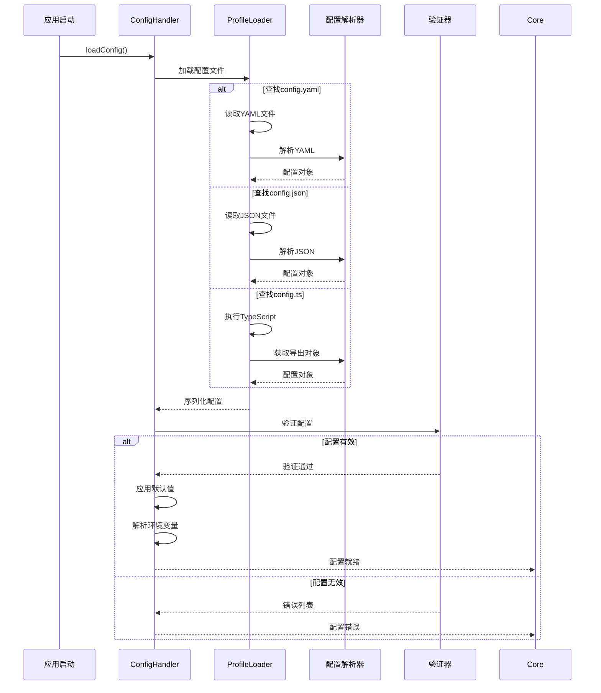

# Continue Core模块设计文档

## 概述

Continue的core模块是整个AI编程助手的核心引擎，提供了聊天对话、代码补全、工具调用、上下文管理、代码索引等核心功能。本文档基于最新代码，深入分析core模块的架构设计、关键实现原理和核心算法。

## 目录

1. [核心架构](#核心架构)
2. [模块详解](#模块详解)
3. [关键算法](#关键算法)
4. [HBuilderX适配](#hbuilderx适配)
5. [性能优化](#性能优化)
6. [最佳实践](#最佳实践)

## 核心架构

### Core类设计

Core类是整个引擎的核心控制器，采用依赖注入和事件驱动的设计模式：

```typescript
export class Core {
  // 子系统
  configHandler: ConfigHandler;
  codeBaseIndexer: CodebaseIndexer;
  completionProvider: CompletionProvider;
  docsService: DocsService;

  // 通信
  private readonly messenger: IMessenger<ToCoreProtocol, FromCoreProtocol>;
  private readonly ide: IDE;

  // 状态管理
  private readonly abortedMessageIds: Set<string>;
  private readonly globalContext: GlobalContext;
  private readonly llmLogger: DataLogger;

  // 工具
  private readonly tts: TTS;
  private readonly chatDescriber: ChatDescriber;
  private readonly gitDiffCache: GitDiffCache;

  constructor(
    messenger: IMessenger<ToCoreProtocol, FromCoreProtocol>,
    ide: IDE,
  ) {
    // 初始化子系统
    this.initializeSubsystems();

    // 绑定消息处理器
    this.setupMessageHandlers();

    // 监听配置变化
    this.setupConfigWatchers();
  }

  private initializeSubsystems() {
    // 1. 配置管理
    this.configHandler = new ConfigHandler(
      this.ide,
      this.llmLogger,
      initialSessionInfoPromise,
    );

    // 2. 文档服务
    this.docsService = DocsService.createSingleton(
      this.configHandler,
      this.ide,
      this.messenger,
    );

    // 3. 代码索引器
    this.codeBaseIndexer = new CodebaseIndexer(
      this.configHandler,
      this.ide,
      this.messenger,
      this.globalContext.get("indexingPaused"),
    );

    // 4. 自动补全
    this.completionProvider = new CompletionProvider(
      this.configHandler,
      this.ide,
      this.messenger,
    );
  }

  private setupMessageHandlers() {
    // 注册所有消息处理器
    this.messenger.on("llm/streamChat", this.handleStreamChat.bind(this));
    this.messenger.on("tools/call", this.handleToolCall.bind(this));
    this.messenger.on(
      "context/getContextItems",
      this.handleGetContextItems.bind(this),
    );
    // ... 更多处理器
  }
}
```

### 模块关系图


```mermaid
graph TB
    subgraph "Core核心"
        Core[Core类]
    end

    subgraph "配置系统"
        ConfigHandler[ConfigHandler<br/>配置处理器]
        ProfileLoader[ProfileLoader<br/>配置加载器]
        ConfigValidator[ConfigValidator<br/>配置验证器]
    end

    subgraph "LLM系统"
        LLMFactory[LLMFactory<br/>模型工厂]
        BaseLLM[BaseLLM<br/>基类]
        OpenAI[OpenAI]
        Anthropic[Anthropic]
        Ollama[Ollama]
    end

    subgraph "工具系统"
        ToolRegistry[ToolRegistry<br/>工具注册表]
        ToolImpl[ToolImpl<br/>工具实现]
        ToolPolicy[ToolPolicy<br/>工具策略]
    end

    subgraph "上下文系统"
        ContextManager[ContextManager<br/>上下文管理器]
        ContextProviders[ContextProviders<br/>提供者集合]
        ContextRetrieval[ContextRetrieval<br/>上下文检索]
    end

    subgraph "索引系统"
        CodebaseIndexer[CodebaseIndexer<br/>索引器]
        LanceDB[LanceDB<br/>向量数据库]
        Embeddings[Embeddings<br/>嵌入模型]
    end

    subgraph "补全系统"
        CompletionProvider[CompletionProvider<br/>补全提供器]
        CompletionCache[CompletionCache<br/>补全缓存]
        CompletionPostprocess[Postprocess<br/>后处理]
    end

    Core --> ConfigHandler
    Core --> LLMFactory
    Core --> ToolRegistry
    Core --> ContextManager
    Core --> CodebaseIndexer
    Core --> CompletionProvider

    ConfigHandler --> ProfileLoader
    ConfigHandler --> ConfigValidator

    LLMFactory --> BaseLLM
    BaseLLM --> OpenAI
    BaseLLM --> Anthropic
    BaseLLM --> Ollama

    ToolRegistry --> ToolImpl
    ToolRegistry --> ToolPolicy

    ContextManager --> ContextProviders
    ContextManager --> ContextRetrieval

    CodebaseIndexer --> LanceDB
    CodebaseIndexer --> Embeddings

    CompletionProvider --> CompletionCache
    CompletionProvider --> CompletionPostprocess

    style Core fill:#f96,stroke:#333,stroke-width:4px
    style ConfigHandler fill:#9cf,stroke:#333,stroke-width:2px
    style LLMFactory fill:#fc9,stroke:#333,stroke-width:2px
    style ToolRegistry fill:#c9f,stroke:#333,stroke-width:2px
```

## 模块详解

### 1. 配置管理系统

**设计目标：**

- 支持多种配置格式（YAML/JSON/TypeScript）
- 支持配置文件继承和覆盖
- 支持环境变量和secrets
- 热重载配置
- 配置验证和错误提示

**关键类：**

```typescript
export class ConfigHandler {
  private profileLoader: ProfileLifecycleManager;
  private currentConfig: ContinueConfig | undefined;
  private configWatchers: FSWatcher[] = [];

  constructor(
    private ide: IDE,
    private writeLog: WriteLog,
    private controlPlaneSessionInfoPromise: Promise<SessionInfo>,
  ) {
    this.profileLoader = new ProfileLifecycleManager(ide);
  }

  async loadConfig(): Promise<ConfigResult> {
    console.log("[hbuilderx] ConfigHandler: Loading configuration");

    try {
      // 1. 加载配置文件
      const serializedConfig = await this.profileLoader.loadConfig();

      // 2. 解析配置
      const config = await this.deserializeConfig(serializedConfig);

      // 3. 验证配置
      const validated = await this.validateConfig(config);

      // 4. 应用默认值
      const withDefaults = await this.applyDefaults(validated);

      // 5. 解析环境变量
      const resolved = await this.resolveEnvVars(withDefaults);

      this.currentConfig = resolved;

      console.log(
        "[hbuilderx] ConfigHandler: Configuration loaded successfully",
      );

      return {
        config: resolved,
        errors: [],
      };
    } catch (error) {
      console.error("[hbuilderx] ConfigHandler: Failed to load configuration", {
        error,
      });
      throw error;
    }
  }

  onConfigUpdate(callback: (config: ContinueConfig) => void): void {
    this.configUpdateCallbacks.push(callback);
  }

  async reloadConfig(reason?: string): Promise<void> {
    console.log("[hbuilderx] ConfigHandler: Reloading configuration", {
      reason,
    });

    const result = await this.loadConfig();

    // 通知所有监听器
    for (const callback of this.configUpdateCallbacks) {
      callback(result.config);
    }
  }
}
```

**配置加载流程：**


```mermaid
sequenceDiagram
    participant App as 应用启动
    participant ConfigHandler as ConfigHandler
    participant ProfileLoader as ProfileLoader
    participant Parser as 配置解析器
    participant Validator as 验证器
    participant Core as Core

    App->>ConfigHandler: loadConfig()
    ConfigHandler->>ProfileLoader: 加载配置文件

    alt 查找config.yaml
        ProfileLoader->>ProfileLoader: 读取YAML文件
        ProfileLoader->>Parser: 解析YAML
        Parser-->>ProfileLoader: 配置对象
    else 查找config.json
        ProfileLoader->>ProfileLoader: 读取JSON文件
        ProfileLoader->>Parser: 解析JSON
        Parser-->>ProfileLoader: 配置对象
    else 查找config.ts
        ProfileLoader->>ProfileLoader: 执行TypeScript
        ProfileLoader->>Parser: 获取导出对象
        Parser-->>ProfileLoader: 配置对象
    end

    ProfileLoader-->>ConfigHandler: 序列化配置

    ConfigHandler->>Validator: 验证配置

    alt 配置有效
        Validator-->>ConfigHandler: 验证通过
        ConfigHandler->>ConfigHandler: 应用默认值
        ConfigHandler->>ConfigHandler: 解析环境变量
        ConfigHandler-->>Core: 配置就绪
    else 配置无效
        Validator-->>ConfigHandler: 错误列表
        ConfigHandler-->>Core: 配置错误
    end
```

### 2. LLM模型系统

**设计目标：**

- 统一多种AI模型的接口
- 支持流式响应
- 支持函数调用
- Token计数和限制
- 错误重试和降级

**BaseLLM抽象类：**

```typescript
export abstract class BaseLLM implements ILLM {
  // 基本信息
  title: string;
  provider: string;
  model: string;

  // API配置
  apiKey: string;
  apiBase: string;

  // 能力标识
  supportsImages?: boolean;
  supportsFim?: boolean;
  supportsCompletions?: boolean;
  supportToolCalling?: boolean;

  constructor(options: ModelOptions) {
    this.title = options.title;
    this.provider = options.provider;
    this.model = options.model;
    this.apiKey = options.apiKey;
    this.apiBase = options.apiBase || this.getDefaultApiBase();
  }

  // 抽象方法，子类必须实现
  abstract streamChat(
    messages: ChatMessage[],
    options: LLMFullCompletionOptions,
  ): AsyncGenerator<ChatMessage>;

  abstract streamComplete(
    prompt: string,
    options: LLMFullCompletionOptions,
  ): AsyncGenerator<string>;

  // 默认实现
  async complete(
    prompt: string,
    options: LLMFullCompletionOptions,
  ): Promise<string> {
    let completion = "";
    for await (const chunk of this.streamComplete(prompt, options)) {
      completion += chunk;
    }
    return completion;
  }

  countTokens(text: string): number {
    // 使用tiktoken或其他tokenizer
    return countTokens(text, this.model);
  }

  // 工具函数
  protected async fetch(url: string, init: RequestInit): Promise<Response> {
    return fetchwithRequestOptions(url, init, this.requestOptions);
  }
}
```

**OpenAI实现示例：**

```typescript
export default class OpenAI extends BaseLLM {
  static providerName = "openai";
  static defaultOptions = {
    apiBase: "https://api.openai.com/v1",
    model: "gpt-4",
  };

  async *streamChat(
    messages: ChatMessage[],
    options: LLMFullCompletionOptions,
  ): AsyncGenerator<ChatMessage> {
    const response = await this.fetch(`${this.apiBase}/chat/completions`, {
      method: "POST",
      headers: {
        "Content-Type": "application/json",
        Authorization: `Bearer ${this.apiKey}`,
      },
      body: JSON.stringify({
        model: this.model,
        messages: messages.map((msg) => ({
          role: msg.role,
          content: msg.content,
        })),
        stream: true,
        tools: options.tools,
      }),
    });

    const reader = response.body.getReader();
    const decoder = new TextDecoder();
    let buffer = "";

    while (true) {
      const { done, value } = await reader.read();
      if (done) break;

      buffer += decoder.decode(value, { stream: true });
      const lines = buffer.split("\n");
      buffer = lines.pop() || "";

      for (const line of lines) {
        if (!line.startsWith("data: ")) continue;
        const data = line.slice(6);
        if (data === "[DONE]") continue;

        try {
          const parsed = JSON.parse(data);
          const delta = parsed.choices[0].delta;

          if (delta.content) {
            yield {
              role: "assistant",
              content: delta.content,
            };
          }

          if (delta.tool_calls) {
            yield {
              role: "assistant",
              content: "",
              toolCalls: delta.tool_calls,
            };
          }
        } catch (error) {
          console.error("[hbuilderx] Failed to parse SSE data", { error });
        }
      }
    }
  }
}
```

### 3. 工具系统

**设计目标：**

- 提供AI可调用的工具集
- 参数解析和验证
- 权限管理和用户确认
- 结果格式化

**工具定义：**

```typescript
export interface ToolDefinition {
  function: {
    name: string;
    description: string;
    parameters: {
      type: "object";
      properties: Record<
        string,
        {
          type: string;
          description: string;
          enum?: string[];
        }
      >;
      required?: string[];
    };
  };
}

export type ToolImpl = (
  args: Record<string, any>,
  extras: ToolCallExtras,
) => Promise<ContextItem[]>;

export interface ToolCallExtras {
  config: ContinueConfig;
  ide: IDE;
  llm: ILLM;
  fetch: FetchFunction;
  tool: Tool;
  toolCallId: string;
  onPartialOutput?: (params: {
    toolCallId: string;
    contextItems: ContextItem[];
  }) => void;
  codeBaseIndexer: CodebaseIndexer;
}
```

**工具注册表：**

```typescript
export const BuiltInTools: Array<{
  definition: ToolDefinition;
  implementation: ToolImpl;
}> = [
  {
    definition: {
      function: {
        name: "readFile",
        description: "Read the contents of a file",
        parameters: {
          type: "object",
          properties: {
            filepath: {
              type: "string",
              description: "Path to the file to read",
            },
          },
          required: ["filepath"],
        },
      },
    },
    implementation: readFileImpl,
  },
  {
    definition: {
      function: {
        name: "searchFiles",
        description: "Search for files matching a pattern",
        parameters: {
          type: "object",
          properties: {
            query: {
              type: "string",
              description: "Search query",
            },
            maxResults: {
              type: "number",
              description: "Maximum number of results",
            },
          },
          required: ["query"],
        },
      },
    },
    implementation: searchFilesImpl,
  },
  // ... 更多工具
];
```

**工具调用流程：**

```typescript
export async function callTool(
  tool: Tool,
  toolCall: ToolCall,
  extras: ToolCallExtras,
): Promise<ToolCallState> {
  console.log("[hbuilderx] callTool: Starting tool execution", {
    toolName: tool.function.name,
    toolCallId: extras.toolCallId,
  });

  try {
    // 1. 解析参数
    const args = parseToolCallArgs(toolCall.function.arguments);
    console.log("[hbuilderx] callTool: Arguments parsed", { args });

    // 2. 检查权限
    const allowed = await checkToolPolicy(tool, args, extras);
    if (!allowed) {
      throw new Error(`Tool ${tool.function.name} not allowed`);
    }

    // 3. 执行工具
    const result = await tool.implementation(args, extras);
    console.log("[hbuilderx] callTool: Tool executed successfully", {
      resultCount: result.length,
    });

    // 4. 返回结果
    return {
      toolCallId: extras.toolCallId,
      toolName: tool.function.name,
      contextItems: result,
      status: "success",
    };
  } catch (error) {
    console.error("[hbuilderx] callTool: Tool execution failed", {
      toolName: tool.function.name,
      error: error instanceof Error ? error.message : String(error),
    });

    return {
      toolCallId: extras.toolCallId,
      toolName: tool.function.name,
      errorMessage: error instanceof Error ? error.message : String(error),
      status: "error",
    };
  }
}
```

### 4. 上下文管理系统

**设计目标：**

- 收集对话相关的上下文
- 支持多种上下文来源
- 控制上下文大小
- 优化上下文质量

**上下文提供者接口：**

```typescript
export interface IContextProvider {
  title: string;
  displayTitle?: string;
  description: string;
  type: ContextProviderType;

  getContextItems(
    query: string,
    extras: ContextProviderExtras,
  ): Promise<ContextItem[]>;

  loadSubmenuItems?(args: LoadSubmenuItemsArgs): Promise<ContextSubmenuItem[]>;
}

export interface ContextProviderExtras {
  config: ContinueConfig;
  ide: IDE;
  llm: ILLM;
  fetch: FetchFunction;
  fullInput: string;
  selectedCode: RangeInFile[];
}
```

**内置上下文提供者实现：**

```typescript
// Code Provider - 提供打开的文件
export class CodeContextProvider implements IContextProvider {
  title = "code";
  description = "Reference the code that is currently open";
  type = "normal" as ContextProviderType;

  async getContextItems(
    query: string,
    extras: ContextProviderExtras,
  ): Promise<ContextItem[]> {
    const openFiles = await extras.ide.getOpenFiles();
    const items: ContextItem[] = [];

    for (const filepath of openFiles) {
      const content = await extras.ide.readFile(filepath);
      items.push({
        name: filepath,
        description: "Open file",
        content,
        uri: {
          type: "file",
          value: filepath,
        },
      });
    }

    return items;
  }
}

// Codebase Provider - 语义搜索代码库
export class CodebaseContextProvider implements IContextProvider {
  title = "codebase";
  description = "Search the codebase using semantic search";
  type = "query" as ContextProviderType;

  async getContextItems(
    query: string,
    extras: ContextProviderExtras,
  ): Promise<ContextItem[]> {
    // 使用代码索引进行语义搜索
    const results = await extras.codebaseIndexer.search(query, 10);

    return results.map((result) => ({
      name: result.filepath,
      description: `Score: ${result.score.toFixed(2)}`,
      content: result.content,
      uri: {
        type: "file",
        value: result.filepath,
      },
    }));
  }
}
```

**上下文收集流程：**

```typescript
export async function getContextItems(
  input: string,
  contextProviders: IContextProvider[],
  extras: ContextProviderExtras,
): Promise<ContextItemWithId[]> {
  console.log("[hbuilderx] 开始收集上下文", {
    input,
    providerCount: contextProviders.length,
  });

  const contextItems: ContextItemWithId[] = [];

  // 解析@mentions
  const mentions = parseMentions(input);

  for (const mention of mentions) {
    const provider = contextProviders.find((p) => p.title === mention.provider);
    if (!provider) continue;

    try {
      const items = await provider.getContextItems(mention.query, extras);

      contextItems.push(
        ...items.map((item, index) => ({
          ...item,
          id: {
            providerTitle: provider.title,
            itemId: `${mention.provider}-${index}`,
          },
        })),
      );

      console.log("[hbuilderx] 上下文提供者成功", {
        provider: mention.provider,
        itemCount: items.length,
      });
    } catch (error) {
      console.error("[hbuilderx] 上下文提供者失败", {
        provider: mention.provider,
        error: error instanceof Error ? error.message : String(error),
      });
    }
  }

  console.log("[hbuilderx] 上下文收集完成", {
    totalItems: contextItems.length,
  });

  return contextItems;
}
```

### 5. 代码索引系统

**设计目标：**

- 构建代码库的向量索引
- 支持语义搜索
- 增量更新
- 性能优化

**CodebaseIndexer类：**

```typescript
export class CodebaseIndexer {
  private lanceDbIndex: LanceDbIndex;
  private chunkIndex: ChunkCodebaseIndex;
  private embeddingsProvider: EmbeddingsProvider;
  private indexingPaused: boolean = false;

  constructor(
    private configHandler: ConfigHandler,
    private ide: IDE,
    private messenger: IMessenger,
    initiallyPaused: boolean = false,
  ) {
    this.indexingPaused = initiallyPaused;
    this.setupIndexing();
  }

  private async setupIndexing() {
    const config = await this.configHandler.loadConfig();

    // 初始化向量数据库
    this.lanceDbIndex = new LanceDbIndex(this.getIndexPath());

    // 初始化嵌入模型
    this.embeddingsProvider = await this.getEmbeddingsProvider(config);

    // 初始化分块索引
    this.chunkIndex = new ChunkCodebaseIndex(
      this.lanceDbIndex,
      this.embeddingsProvider,
    );
  }

  async indexCodebase(dirs: string[]): Promise<void> {
    if (this.indexingPaused) {
      console.log("[hbuilderx] 索引已暂停，跳过");
      return;
    }

    console.log("[hbuilderx] 开始索引代码库", { dirs });

    try {
      // 1. 扫描文件
      const files = await this.scanFiles(dirs);
      console.log("[hbuilderx] 扫描到文件", { fileCount: files.length });

      // 2. 过滤文件
      const filtered = await this.filterFiles(files);

      // 3. 分块
      const chunks = await this.chunkFiles(filtered);
      console.log("[hbuilderx] 生成代码块", { chunkCount: chunks.length });

      // 4. 生成嵌入向量
      const embeddings = await this.embeddingsProvider.embed(
        chunks.map((c) => c.content),
      );
      console.log("[hbuilderx] 生成嵌入向量", { count: embeddings.length });

      // 5. 插入索引
      await this.lanceDbIndex.insert(chunks, embeddings);

      // 6. 通知完成
      this.messenger.send("indexingProgress", {
        progress: 1.0,
        status: "完成",
      });

      console.log("[hbuilderx] 代码库索引完成");
    } catch (error) {
      console.error("[hbuilderx] 代码库索引失败", { error });
      throw error;
    }
  }

  async search(query: string, n: number = 10): Promise<Chunk[]> {
    console.log("[hbuilderx] 搜索代码库", { query, n });

    try {
      // 1. 生成查询向量
      const queryEmbedding = await this.embeddingsProvider.embed([query]);

      // 2. 向量搜索
      const results = await this.lanceDbIndex.search(queryEmbedding[0], n * 2);

      // 3. 重排序
      const reranked = await this.rerank(query, results, n);

      console.log("[hbuilderx] 搜索完成", { resultCount: reranked.length });

      return reranked;
    } catch (error) {
      console.error("[hbuilderx] 搜索失败", { error });
      return [];
    }
  }

  async updateIndex(changedFiles: string[]): Promise<void> {
    console.log("[hbuilderx] 增量更新索引", {
      changedFileCount: changedFiles.length,
    });

    // 删除旧索引
    await this.lanceDbIndex.deleteByFilepaths(changedFiles);

    // 重新索引修改的文件
    await this.indexCodebase(changedFiles);
  }
}
```

### 6. 自动补全系统

**设计目标：**

- 提供代码补全建议
- 上下文感知
- 性能优化（缓存、防抖）
- 后处理和过滤

**CompletionProvider类：**

```typescript
export class CompletionProvider {
  private cache: CompletionCache;
  private debouncer: CompletionDebouncer;

  constructor(
    private configHandler: ConfigHandler,
    private ide: IDE,
    private messenger: IMessenger,
  ) {
    this.cache = new CompletionCache();
    this.debouncer = new CompletionDebouncer();
  }

  async provideInlineCompletionItems(
    document: TextDocument,
    position: Position,
    context: InlineCompletionContext,
  ): Promise<InlineCompletionItem[]> {
    // 防抖
    await this.debouncer.debounce();

    // 收集上下文
    const { prefix, suffix } = await this.getContext(document, position);

    // 检查缓存
    const cacheKey = `${prefix}${suffix}`;
    const cached = this.cache.get(cacheKey);
    if (cached) {
      console.log("[hbuilderx] 使用缓存的补全");
      return [cached];
    }

    // 获取配置
    const config = await this.configHandler.loadConfig();
    const llm = config.selectedModelByRole.autocomplete;
    if (!llm) {
      return [];
    }

    // 调用FIM模型
    let completion = "";
    for await (const chunk of llm.streamFim({
      prefix,
      suffix,
      language: document.languageId,
    })) {
      completion += chunk;
    }

    // 后处理
    const processed = await this.postprocess(completion, {
      prefix,
      suffix,
      language: document.languageId,
    });

    if (!processed) {
      return [];
    }

    // 缓存结果
    const item: InlineCompletionItem = {
      insertText: processed,
      range: new Range(position, position),
    };
    this.cache.set(cacheKey, item);

    console.log("[hbuilderx] 生成补全", { length: processed.length });

    return [item];
  }

  private async postprocess(
    completion: string,
    context: CompletionContext,
  ): Promise<string | null> {
    // 1. 移除重复前缀
    if (completion.startsWith(context.prefix.slice(-50))) {
      completion = completion.slice(context.prefix.slice(-50).length);
    }

    // 2. 截断到自然边界
    const lines = completion.split("\n");
    if (lines.length > 5) {
      completion = lines.slice(0, 5).join("\n");
    }

    // 3. 过滤无效补全
    if (completion.trim().length < 3) {
      return null;
    }

    // 4. 格式化
    completion = completion.trimEnd();

    return completion;
  }
}
```

## 关键算法

### 1. 上下文压缩算法

当上下文超出模型限制时，需要智能压缩：

```typescript
export async function compactConversation(
  messages: ChatMessage[],
  maxTokens: number,
  llm: ILLM,
): Promise<ChatMessage[]> {
  const compacted: ChatMessage[] = [];
  let currentTokens = 0;

  // 1. 保留系统消息
  const systemMessages = messages.filter((m) => m.role === "system");
  for (const msg of systemMessages) {
    compacted.push(msg);
    currentTokens += llm.countTokens(msg.content);
  }

  // 2. 保留最后N条消息
  const recentMessages = messages.slice(-10);
  for (const msg of recentMessages) {
    const tokens = llm.countTokens(msg.content);
    if (currentTokens + tokens > maxTokens) {
      // 3. 压缩消息内容
      const compressed = await compressMessage(
        msg,
        maxTokens - currentTokens,
        llm,
      );
      if (compressed) {
        compacted.push(compressed);
      }
      break;
    }
    compacted.push(msg);
    currentTokens += tokens;
  }

  return compacted;
}

async function compressMessage(
  message: ChatMessage,
  maxTokens: number,
  llm: ILLM,
): Promise<ChatMessage | null> {
  // 使用LLM总结消息内容
  const summary = await llm.complete(
    `Summarize the following in ${maxTokens} tokens:\n\n${message.content}`,
    { maxTokens },
  );

  return {
    role: message.role,
    content: summary,
  };
}
```

### 2. 代码分块算法

基于语法树的智能分块：

```typescript
export async function chunkCode(
  filepath: string,
  content: string,
  language: string,
): Promise<Chunk[]> {
  const chunks: Chunk[] = [];

  // 1. 解析语法树
  const tree = await parseCodeWithTreeSitter(content, language);

  // 2. 提取顶层定义
  const definitions = extractTopLevelDefinitions(tree);

  for (const def of definitions) {
    // 3. 创建代码块
    chunks.push({
      filepath,
      content: def.text,
      startLine: def.startLine,
      endLine: def.endLine,
      type: def.type, // function/class/interface
      name: def.name,
    });
  }

  // 4. 对于大文件，使用滑动窗口
  if (chunks.length === 0 || content.length > 10000) {
    const windowChunks = await chunkWithSlidingWindow(
      filepath,
      content,
      512, // window size
      128, // overlap
    );
    chunks.push(...windowChunks);
  }

  return chunks;
}
```

### 3. 语义搜索重排序

提高搜索结果相关性：

```typescript
export async function rerank(
  query: string,
  results: SearchResult[],
  topK: number,
  llm: ILLM,
): Promise<SearchResult[]> {
  // 1. 使用BM25进行初步排序
  const bm25Scores = calculateBM25(query, results);

  // 2. 使用LLM进行重排序
  const rerankedPromises = results.map(async (result, index) => {
    const prompt = `
Rate how relevant this code snippet is to the query "${query}" on a scale of 0-10.
Code: ${result.content.slice(0, 500)}
Rating:`;

    const rating = await llm.complete(prompt, { maxTokens: 10 });
    const score = parseFloat(rating) || 0;

    return {
      ...result,
      rerankScore: score * 0.7 + bm25Scores[index] * 0.3,
    };
  });

  const reranked = await Promise.all(rerankedPromises);

  // 3. 排序并返回top K
  return reranked.sort((a, b) => b.rerankScore - a.rerankScore).slice(0, topK);
}

function calculateBM25(query: string, documents: SearchResult[]): number[] {
  // BM25算法实现
  const queryTerms = tokenize(query);
  const avgDocLength =
    documents.reduce((sum, doc) => sum + doc.content.length, 0) /
    documents.length;

  return documents.map((doc) => {
    let score = 0;
    for (const term of queryTerms) {
      const tf = termFrequency(term, doc.content);
      const idf = inverseDocumentFrequency(term, documents);
      score +=
        (idf * (tf * (1.5 + 1))) /
        (tf + 1.5 * (1 - 0.75 + (0.75 * doc.content.length) / avgDocLength));
    }
    return score;
  });
}
```

## HBuilderX适配

### 日志增强

所有关键操作添加日志：

```typescript
// core/core.ts
private async handleToolCall(toolCall: ToolCall) {
  console.log("[hbuilderx] handleToolCall: Starting", {
    toolCallId: toolCall.id,
    functionName: toolCall.function.name,
  });

  try {
    // ... 处理逻辑
    console.log("[hbuilderx] handleToolCall: Completed", {
      toolCallId: toolCall.id,
    });
  } catch (error) {
    console.error("[hbuilderx] handleToolCall: Failed", {
      toolCallId: toolCall.id,
      error: error instanceof Error ? error.message : String(error),
    });
    throw error;
  }
}
```

### 平台识别

```typescript
// core/util/platform.ts
export type Platform = "MAC" | "LINUX" | "WINDOWS" | "UNKNOWN";

export function getPlatform(): Platform {
  const platform = os.platform();
  if (platform === "darwin") return "MAC";
  if (platform === "linux") return "LINUX";
  if (platform === "win32") return "WINDOWS";
  return "UNKNOWN";
}
```

### uni-app系统消息

```typescript
// core/llm/uniappDefaultSystemMessage.ts
import { getPlatform } from "../util/platform.js";

export const UNIAPP_OS_ENV_LABEL = getPlatform();

export const UNIAPP_DEFAULT_SYSTEM_MESSAGE = `\
你是一位在HBuilderX的AI辅助编程助手，专精uni-app生态和鸿蒙元服务开发。
当前在${UNIAPP_OS_ENV_LABEL}环境下运行。

## 核心专业领域：
### uni-app跨平台开发
- 熟悉uni-app API和组件
- 熟悉条件编译
- 熟悉Vue.js 3.x

### 鸿蒙元服务
- 精通uni-app适配鸿蒙元服务
- 熟悉元服务的条件编译是MP-HARMONY
...
`;
```

### 配置默认值

HBuilderX默认禁用索引：

```typescript
// core/config/load.ts
function loadSerializedConfig(...) {
  // Default to indexing disabled if not explicitly set
  if (config.disableIndexing === undefined) {
    config.disableIndexing = true;
  }

  return config;
}
```

## 性能优化

### 1. 缓存策略

```typescript
export class MultiLevelCache<T> {
  private memoryCache = new Map<string, T>();
  private lruCache = new LRUCache<T>(100);

  get(key: string): T | undefined {
    // Level 1: Memory cache
    if (this.memoryCache.has(key)) {
      return this.memoryCache.get(key);
    }

    // Level 2: LRU cache
    const value = this.lruCache.get(key);
    if (value) {
      this.memoryCache.set(key, value);
      return value;
    }

    return undefined;
  }

  set(key: string, value: T): void {
    this.memoryCache.set(key, value);
    this.lruCache.set(key, value);
  }
}
```

### 2. 批处理

```typescript
export class BatchProcessor<T, R> {
  private batch: T[] = [];
  private timeout: NodeJS.Timeout | null = null;

  async add(item: T): Promise<R> {
    return new Promise((resolve) => {
      this.batch.push(item);

      if (this.timeout) {
        clearTimeout(this.timeout);
      }

      this.timeout = setTimeout(() => {
        this.processBatch();
      }, 100);
    });
  }

  private async processBatch(): Promise<void> {
    const items = this.batch;
    this.batch = [];

    // 批量处理
    await this.processor(items);
  }
}
```

### 3. 流式处理

```typescript
export async function* processStream<T>(
  stream: AsyncIterable<T>,
  processor: (item: T) => Promise<T>,
): AsyncGenerator<T> {
  for await (const item of stream) {
    const processed = await processor(item);
    yield processed;
  }
}
```

## 最佳实践

### 1. 错误处理

```typescript
try {
  const result = await operation();
  console.log("[hbuilderx] 操作成功", { result });
  return result;
} catch (error) {
  console.error("[hbuilderx] 操作失败", {
    error: error instanceof Error ? error.message : String(error),
    stack: error instanceof Error ? error.stack : undefined,
  });
  throw error;
}
```

### 2. 类型安全

```typescript
// 使用严格的类型定义
export interface StrictConfig {
  readonly models: ReadonlyArray<ModelConfig>;
  readonly tools: ReadonlyArray<ToolConfig>;
}

// 使用类型守卫
function isModelConfig(obj: any): obj is ModelConfig {
  return (
    typeof obj === "object" &&
    typeof obj.title === "string" &&
    typeof obj.provider === "string"
  );
}
```

### 3. 资源管理

```typescript
export class ResourceManager {
  private resources = new Set<Resource>();

  register(resource: Resource): void {
    this.resources.add(resource);
  }

  async dispose(): Promise<void> {
    for (const resource of this.resources) {
      await resource.dispose();
    }
    this.resources.clear();
  }
}
```

## 总结

Continue的core模块是一个设计精良、功能完整的AI编程助手引擎，具有以下特点：

1. **模块化设计**：清晰的职责划分，各模块独立可测
2. **扩展性强**：插件化的工具、上下文提供者、LLM适配
3. **性能优化**：多级缓存、批处理、流式处理
4. **类型安全**：完整的TypeScript类型定义
5. **HBuilderX适配**：日志增强、平台识别、uni-app支持

通过深入理解core模块的设计和实现，可以更好地进行功能扩展、性能优化和IDE适配。
