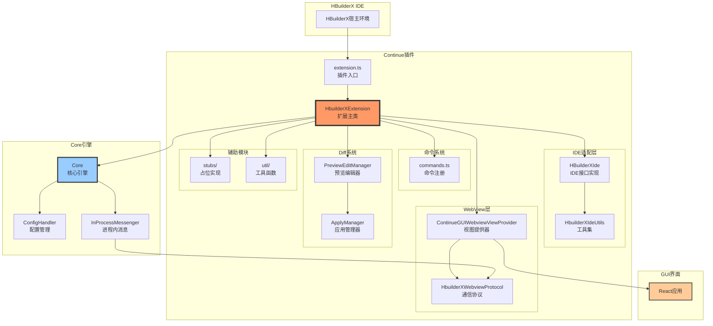
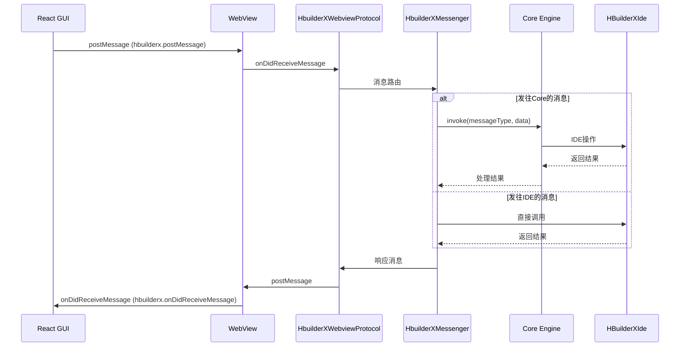

# HBuilderX插件开发适配文档

## 概述

本文档详细介绍Continue AI助手适配HBuilderX IDE的插件开发过程，包括架构设计、核心实现、关键适配点和开发指南。

## 目录

1. [插件架构](#插件架构)
2. [核心模块实现](#核心模块实现)
3. [HBuilderX API适配](#hbuilderx-api适配)
4. [通信机制](#通信机制)
5. [开发和调试](#开发和调试)
6. [打包和分发](#打包和分发)

## 插件架构

### 整体架构



### 目录结构

```
extensions/hbuilderx/
├── src/
│   ├── extension.ts                 # 插件入口（activate/deactivate）
│   ├── extension/
│   │   ├── HbuilderXExtension.ts   # 扩展主类
│   │   └── HBuilderXMessenger.ts   # 消息传递桥接
│   ├── HBuilderXIde.ts             # IDE接口实现
│   ├── ContinueGUIWebviewViewProvider.ts  # WebView提供器
│   ├── webviewProtocol.ts          # WebView通信协议
│   ├── commands.ts                 # 命令注册和处理
│   ├── apply/                      # 代码应用系统
│   │   ├── ApplyManager.ts
│   │   ├── index.ts
│   │   └── utils.ts
│   ├── diff/                       # Diff管理系统
│   │   ├── PreviewEditManager.ts
│   │   ├── PreviewEditSessionStore.ts
│   │   └── index.ts
│   ├── quickEdit/                  # 快速编辑
│   │   ├── EditDecorationManager.ts
│   │   └── ...
│   ├── stubs/                      # 占位实现
│   │   ├── SecretStorage.ts
│   │   ├── WorkOsAuthProvider.ts
│   │   ├── auth.ts
│   │   └── ...
│   ├── util/                       # 工具函数
│   │   ├── hbuilderx.ts           # HBuilderX特定工具
│   │   ├── ideUtils.ts            # IDE工具集
│   │   ├── fsUtil.ts              # 文件系统工具
│   │   └── ...
│   └── terminal/
│       └── terminalEmulator.ts     # 终端模拟器
├── package.json                    # 插件配置文件
├── scripts/                        # 构建脚本
│   ├── esbuild.js
│   ├── package.js
│   └── ...
└── tsconfig.json                   # TypeScript配置
```

## 核心模块实现

### 1. 插件入口（extension.ts）

插件入口负责初始化和清理工作：

```typescript
function activate(context: any) {
  console.log("[hbuilderx]Continue扩展正在激活...");

  try {
    // 添加必要文件
    getTsConfigPath();

    // 创建扩展主实例
    const _ = new HbuilderXExtension(context);

    // 记录安装事件
    if (!context.workspaceState.get("hasBeenInstalled")) {
      context.workspaceState.update("hasBeenInstalled", true);
      Telemetry.capture(
        "install",
        {
          extensionVersion: getExtensionVersion(),
        },
        true,
      );
    }
  } catch (error) {
    console.error("[hbuilderx]Continue扩展激活失败:", error);
  }

  console.log("[hbuilderx]Continue扩展激活完成");
}

function deactivate() {
  console.log("[hbuilderx]Continue扩展正在停用...");

  Telemetry.capture(
    "deactivate",
    {
      extensionVersion: getExtensionVersion(),
    },
    true,
  );

  Telemetry.shutdownPosthogClient();

  console.log("[hbuilderx]Continue扩展停用完成");
}

module.exports = { activate, deactivate };
```

**关键点：**

- 使用 `console.log` 并添加 `[hbuilderx]` 前缀用于日志追踪
- 不使用async/await，避免兼容性问题
- 使用 `module.exports` 导出（CommonJS格式）

### 2. 扩展主类（HbuilderXExtension.ts）

扩展主类协调所有子模块：

```typescript
export class HbuilderXExtension {
  private windowId: string;
  private ide: HbuilderXIde;
  private extensionContext: any;
  webviewProtocolPromise: Promise<HbuilderXWebviewProtocol>;
  private sidebar: ContinueGUIWebviewViewProvider;
  private core: Core;
  private configHandler: ConfigHandler;

  constructor(extensionContext: any) {
    console.log("[hbuilderx] HbuilderXExtension构造函数开始");

    // 1. 创建WebView Promise
    let resolveWebviewProtocol: any = undefined;
    this.webviewProtocolPromise = new Promise<HbuilderXWebviewProtocol>(
      (resolve) => {
        resolveWebviewProtocol = resolve;
      },
    );

    // 2. 初始化IDE适配层
    this.ide = new HbuilderXIde(this.webviewProtocolPromise, extensionContext);
    this.windowId = uuidv4();

    // 3. 创建ConfigHandler Promise
    let resolveConfigHandler: any = undefined;
    const configHandlerPromise = new Promise<ConfigHandler>((resolve) => {
      resolveConfigHandler = resolve;
    });

    // 4. 创建WebView面板
    let webviewPanel = hx.window.createWebView("continue.continueGUIView", {
      enableScripts: true,
    });

    // 5. 初始化GUI提供器
    this.sidebar = new ContinueGUIWebviewViewProvider(
      webviewPanel,
      configHandlerPromise,
      this.windowId,
      this.extensionContext,
    );

    // 6. 解析WebView协议
    resolveWebviewProtocol(this.sidebar.webviewProtocol);

    // 7. 创建消息传递系统
    const inProcessMessenger = new InProcessMessenger<
      ToCoreProtocol,
      FromCoreProtocol
    >();

    // 8. 初始化消息桥接
    new HbuilderXMessenger(
      inProcessMessenger,
      this.sidebar.webviewProtocol,
      this.ide,
      configHandlerPromise,
    );

    // 9. 初始化Core引擎
    this.core = new Core(inProcessMessenger, this.ide);
    this.configHandler = this.core.configHandler;
    resolveConfigHandler?.(this.configHandler);

    // 10. 加载配置
    this.configHandler.loadConfig();

    // 11. 注册所有命令
    registerAllCommands(
      extensionContext,
      this.ide,
      this.sidebar,
      this.configHandler,
      Promise.resolve(null as any), // continueServerClientPromise暂未实现
      this.core,
    );

    // 12. 监听文件变化
    hx.workspace.onDidSaveTextDocument(async (event: any) => {
      this.core.invoke("files/changed", {
        uris: [event.uri.toString()],
      });
    });

    hx.workspace.onDidCloseTextDocument(async (event: any) => {
      this.core.invoke("files/closed", {
        uris: [event.uri.toString()],
      });
    });
  }
}
```

**初始化流程：**

1. 创建WebView和ConfigHandler的Promise（用于异步依赖解析）
2. 初始化IDE适配层
3. 创建WebView面板
4. 初始化GUI提供器
5. 建立消息传递系统
6. 初始化Core引擎
7. 注册命令和事件监听器

### 3. IDE接口实现（HBuilderXIde.ts）

实现Continue的IDE接口，将HBuilderX API映射到Continue的统一接口：

```typescript
class HbuilderXIde implements IDE {
  ideUtils: HbuilderXIdeUtils;
  secretStorage: SecretStorage;

  constructor(
    private readonly hbuilderXWebviewProtocolPromise: Promise<HbuilderXWebviewProtocol>,
    private readonly context: any,
  ) {
    this.ideUtils = new HbuilderXIdeUtils();
    this.secretStorage = new SecretStorage(context);
  }

  // IDE信息
  getIdeInfo(): Promise<IdeInfo> {
    return Promise.resolve({
      ideType: "hbuilderx",
      name: hx.env.appName,
      version: hx.env.appVersion,
      remoteName: "local",
      extensionVersion: getExtensionVersion(),
      isPrerelease: false,
    });
  }

  // 工作区目录
  getWorkspaceDirs(): Promise<string[]> {
    return Promise.resolve(
      this.ideUtils.getWorkspaceDirectories().map((uri: any) => uri.toString()),
    );
  }

  // 文件操作
  async readFile(fileUri: string): Promise<string> {
    const uri = hx.Uri.parse(fileUri);

    // 检查是否为已打开的文档
    const openTextDocument = hx.workspace.textDocuments.find((doc: any) =>
      URI.equal(doc.uri.toString(), uri.toString()),
    );
    if (openTextDocument !== undefined) {
      return openTextDocument.getText();
    }

    // 从文件系统读取
    const fileStats = await this.ideUtils.stat(uri);
    if (fileStats === null || fileStats.size > 10 * HbuilderXIde.MAX_BYTES) {
      return "";
    }

    const bytes = await this.ideUtils.readFile(uri);
    if (bytes === null) {
      return "";
    }

    const truncatedBytes = bytes.slice(0, HbuilderXIde.MAX_BYTES);
    return new TextDecoder().decode(truncatedBytes);
  }

  async writeFile(path: string, contents: string): Promise<void> {
    await this.ideUtils.writeFile(path, contents);
  }

  // Ripgrep搜索
  async getSearchResults(query: string, maxResults?: number): Promise<string> {
    const results: string[] = [];
    for (const dir of await this.getWorkspaceDirs()) {
      const dirResults = await this.runRipgrepQuery(dir, [
        "-i", // Case-insensitive
        "--ignore-file",
        ".continueignore",
        "--ignore-file",
        ".gitignore",
        "-C",
        "2", // Context lines
        "--heading",
        ...(maxResults ? ["-m", maxResults.toString()] : []),
        "-e",
        query,
        ".",
      ]);
      results.push(dirResults);
    }
    return results.join("\n");
  }

  // Ripgrep执行
  runRipgrepQuery(dirUri: string, args: string[]) {
    const relativeDir = hx.Uri.parse(dirUri).fsPath;
    const ripgrepPath = this.resolveRipgrepPath();

    const p = child_process.spawn(ripgrepPath, args, {
      cwd: relativeDir,
    });

    let output = "";
    p.stdout.on("data", (data) => {
      output += data.toString();
    });

    return new Promise<string>((resolve, reject) => {
      p.on("error", (error) => {
        reject(error);
      });

      p.on("close", (code) => {
        if (code === 0) {
          resolve(output);
        } else if (code === 1) {
          resolve("No matches found");
        } else {
          reject(new Error(`Process exited with code ${code}`));
        }
      });
    });
  }

  private resolveRipgrepPath(): string {
    const exe = process.platform === "win32" ? ".exe" : "";
    const extensionDir = getExtensionUri();

    const candidates: string[] = [];
    if (extensionDir && typeof extensionDir === "string") {
      candidates.push(
        path.join(extensionDir, "..", "ripgrep", "bin", `rg${exe}`),
      );
    }

    for (const c of candidates) {
      if (c && fs.existsSync(c)) {
        return c;
      }
    }

    // 兜底：HBuilderX内置路径（macOS）
    const macBuiltin =
      "/Applications/HBuilderX-Alpha.app/Contents/HBuilderX/plugins/ripgrep/bin/rg";
    if (process.platform === "darwin" && fs.existsSync(macBuiltin)) {
      return macBuiltin;
    }

    throw new Error("未能定位 ripgrep 可执行文件");
  }

  private static MAX_BYTES = 100000;
}
```

**关键适配点：**

- `ideType` 设置为 `"hbuilderx"`
- 文件读取优先检查已打开的文档
- Ripgrep路径解析支持HBuilderX内置ripgrep
- 日志添加 `[hbuilderx]` 前缀
- 文件大小限制为100KB避免内存问题

### 4. WebView提供器（ContinueGUIWebviewViewProvider.ts）

管理WebView的生命周期和内容：

```typescript
export class ContinueGUIWebviewViewProvider {
  public static readonly viewType = "continue.continueGUIView";
  public webviewProtocol: HbuilderXWebviewProtocol;

  constructor(
    private readonly webviewPanel: any,
    private readonly configHandlerPromise: Promise<ConfigHandler>,
    private readonly windowId: string,
    private readonly extensionContext: any,
  ) {
    this.webviewProtocol = new HbuilderXWebviewProtocol(
      (async () => {
        const configHandler = await this.configHandlerPromise;
        return configHandler.reloadConfig();
      }).bind(this),
    );

    this._webviewPanel = webviewPanel;
    this._webview = webviewPanel._webView;

    // 生成并设置HTML内容
    this.getSidebarContent(this.extensionContext, webviewPanel);
  }

  async getSidebarContent(
    context: any,
    panel: any,
    page: string | undefined = undefined,
    edits: FileEdit[] | undefined = undefined,
    isFullScreen = false,
  ) {
    const extensionUri = getExtensionUri();
    const vscMediaUrl: string = hx.Uri.file(`${extensionUri}/gui`).toString();

    // 生产模式资源
    let scriptUri = hx.Uri.file(
      `${extensionUri}/gui/assets/index.js`,
    ).toString();
    let styleMainUri = hx.Uri.file(
      `${extensionUri}/gui/assets/index.css`,
    ).toString();

    // 配置WebView选项
    this._webview.options = {
      enableScripts: true,
      localResourceRoots: [
        hx.Uri.file(`${extensionUri}/gui`),
        hx.Uri.file(`${extensionUri}/assets`),
      ],
      enableCommandUris: true,
    };

    const nonce = getNonce();

    this.webviewProtocol.webview = panel._webView;

    // 生成HTML
    const html = `<!DOCTYPE html>
    <html lang="en">
      <head>
        <meta charset="UTF-8">
        <meta name="viewport" content="width=device-width, initial-scale=1.0">
        <link href="${styleMainUri}" rel="stylesheet">
        <style>
          * {
            font-family: -apple-system, BlinkMacSystemFont, "Segoe UI", sans-serif !important;
          }
          :lang(zh), :lang(zh-CN), :lang(zh-TW) {
            font-family: -apple-system, "PingFang SC", "Microsoft YaHei", sans-serif !important;
          }
        </style>
        <title>Continue</title>
      </head>
      <body lang="zh-CN">
        <div id="root"></div>
        <script type="module" nonce="${nonce}" src="${scriptUri}"></script>
        
        <!-- 全局变量 -->
        <script>localStorage.setItem("ide", '"hbuilderx"')</script>
        <script>localStorage.setItem("extensionVersion", '"${getExtensionVersion()}"')</script>
        <script>window.windowId = "${this.windowId}"</script>
        <script>window.vscMachineId = "${getUniqueId()}"</script>
        <script>window.vscMediaUrl = "${vscMediaUrl}"</script>
        <script>window.ide = "hbuilderx"</script>
        <script>window.workspacePaths = ${JSON.stringify(
          hx.workspace.workspaceFolders?.map((folder: any) =>
            folder.uri.toString(),
          ) || [],
        )}</script>
      </body>
    </html>`;

    webviewPanel.webView.html = html;
  }
}
```

**HTML生成要点：**

- 设置 `window.ide = "hbuilderx"` 用于GUI识别IDE类型
- 配置中文字体以支持更好的显示
- 使用nonce提高安全性
- 设置工作区路径供GUI使用

### 5. WebView通信协议（webviewProtocol.ts）

实现IDE与GUI之间的双向通信：

```typescript
export class HbuilderXWebviewProtocol extends AbstractWebviewProtocol {
  constructor(
    reloadConfig: () => Promise<ConfigResult>,
    invoke: <T extends keyof ToCoreProtocol>(
      messageType: T,
      data: ToCoreProtocol[T][0],
    ) => ToCoreProtocol[T][1],
  ) {
    super(reloadConfig, invoke);
  }

  // 从WebView接收消息
  onWebviewMessage(callback: (data: any) => void) {
    if (!this._webview) {
      console.warn("[hbuilderx] WebView not initialized");
      return;
    }

    this._webview.onDidReceiveMessage((data: any) => {
      console.log("[hbuilderx] 从WebView收到消息:", data.messageType);
      callback(data);
    });
  }

  // 向WebView发送消息
  async sendMessageToWebview<T extends keyof FromWebviewProtocol>(
    messageType: T,
    data: FromWebviewProtocol[T][0],
    messageId?: string,
  ): Promise<FromWebviewProtocol[T][1]> {
    if (!this._webview) {
      console.warn(
        "[hbuilderx] WebView not initialized, cannot send:",
        messageType,
      );
      throw new Error("WebView not initialized");
    }

    const message: Message = {
      messageId: messageId ?? uuidv4(),
      messageType,
      data,
    };

    console.log("[hbuilderx] 向WebView发送消息:", messageType);
    this._webview.postMessage(message);
  }
}
```

**通信机制：**

- 使用 `onDidReceiveMessage` 接收WebView消息
- 使用 `postMessage` 发送消息到WebView
- 消息格式包含 `messageId`、`messageType` 和 `data`

## HBuilderX API适配

### 关键差异

HBuilderX API与VSCode API有以下主要差异：

| 功能         | VSCode                              | HBuilderX                         | 适配方案        |
| ------------ | ----------------------------------- | --------------------------------- | --------------- |
| 模块引入     | `import * as vscode from 'vscode'`  | `const hx = require("hbuilderx")` | 使用require引入 |
| 命令执行     | `vscode.commands.executeCommand`    | `hx.commands.executeCommand`      | 直接替换        |
| WebView创建  | `vscode.window.createWebviewPanel`  | `hx.window.createWebView`         | 使用不同的API   |
| 消息监听     | `webview.onDidReceiveMessage`       | `webview.onDidReceiveMessage`     | 相同            |
| 工作区文件夹 | `vscode.workspace.workspaceFolders` | `hx.workspace.workspaceFolders`   | 相同            |
| 文件URI      | `vscode.Uri.file(path)`             | `hx.Uri.file(path)`               | 相同            |
| 环境信息     | `vscode.env`                        | `hx.env`                          | 相同            |

### HBuilderX特定工具（hbuilderx.ts）

```typescript
export function getExtensionUri(): string | undefined {
  const __filename = fileURLToPath(import.meta.url);
  const extensionUri = path.resolve(__filename, "..", "..", "..");
  return extensionUri;
}

export function getNonce(): string {
  let text = "";
  const possible =
    "ABCDEFGHIJKLMNOPQRSTUVWXYZabcdefghijklmnopqrstuvwxyz0123456789";
  for (let i = 0; i < 32; i++) {
    text += possible.charAt(Math.floor(Math.random() * possible.length));
  }
  return text;
}

export function getUniqueId(): string {
  return machineIdSync();
}

export async function openEditorAndRevealRange(
  uri: any,
  range: { start: number; end: number },
): Promise<any> {
  const editor = await hx.workspace.openTextDocument(uri);
  const textEditor = await hx.window.showTextDocument(editor);

  // 滚动到指定范围
  textEditor.revealRange({
    start: { line: range.start, character: 0 },
    end: { line: range.end, character: 0 },
  });

  return textEditor;
}
```

### 文件系统工具（fsUtil.ts）

```typescript
export enum NodeFileType {
  File = 1,
  Directory = 2,
  SymbolicLink = 64,
}

export class FileSystemUtils {
  async readFile(uri: any): Promise<Buffer | null> {
    try {
      const content = await fs.promises.readFile(uri.fsPath);
      return content;
    } catch (error) {
      console.error("[hbuilderx] readFile error:", error);
      return null;
    }
  }

  async writeFile(uri: any, content: string): Promise<void> {
    await fs.promises.writeFile(uri.fsPath, content, "utf-8");
  }

  async stat(uri: any): Promise<any | null> {
    try {
      const stats = await fs.promises.stat(uri.fsPath);
      return {
        type: stats.isDirectory() ? NodeFileType.Directory : NodeFileType.File,
        size: stats.size,
        mtime: stats.mtimeMs,
        ctime: stats.ctimeMs,
      };
    } catch (error) {
      return null;
    }
  }

  async readDirectory(uri: any): Promise<[string, NodeFileType][] | null> {
    try {
      const entries = await fs.promises.readdir(uri.fsPath, {
        withFileTypes: true,
      });
      return entries.map((entry) => [
        entry.name,
        entry.isDirectory() ? NodeFileType.Directory : NodeFileType.File,
      ]);
    } catch (error) {
      return null;
    }
  }
}
```

## 通信机制

### 消息流向



### GUI端消息适配（IdeMessenger.tsx）

GUI需要识别HBuilderX环境并使用对应的API：

```typescript
// 判断是否为HBuilderX环境
function isHBuilderX(): boolean {
  return typeof hbuilderx !== "undefined";
}

export class IdeMessenger implements IIdeMessenger {
  post<T extends keyof FromWebviewProtocol>(
    messageType: T,
    data: FromWebviewProtocol[T][0],
    messageId?: string,
  ): void {
    if (isHBuilderX()) {
      // HBuilderX消息发送
      const msg: Message = { messageId, messageType, data };
      hbuilderx.postMessage(msg);
      return;
    } else if (isJetBrains()) {
      // IntelliJ消息发送
      window.postIntellijMessage?.(messageType, data, messageId);
      return;
    } else {
      // VSCode消息发送
      vscode.postMessage({ messageId, messageType, data });
    }
  }

  request<T extends keyof FromWebviewProtocol>(
    messageType: T,
    data: FromWebviewProtocol[T][0],
  ): Promise<FromWebviewProtocol[T][1]> {
    const messageId = uuidv4();

    return new Promise((resolve) => {
      if (isHBuilderX()) {
        // HBuilderX使用onDidReceiveMessage监听
        const handler = (msg: any) => {
          if (msg.messageId === messageId) {
            resolve(msg.data as WebviewSingleMessage<T>);
          }
        };

        if (typeof hbuilderx !== "undefined" && hbuilderx.onDidReceiveMessage) {
          hbuilderx.onDidReceiveMessage(handler);
        }
      } else {
        // VSCode和IntelliJ使用window.addEventListener
        const handler = (event: any) => {
          if (event.data.messageId === messageId) {
            window.removeEventListener("message", handler);
            resolve(event.data.data as WebviewSingleMessage<T>);
          }
        };
        window.addEventListener("message", handler);
      }

      this.post(messageType, data, messageId);
    });
  }
}
```

**关键点：**

- 通过 `typeof hbuilderx !== "undefined"` 判断HBuilderX环境
- HBuilderX使用 `hbuilderx.postMessage` 和 `hbuilderx.onDidReceiveMessage`
- VSCode使用 `vscode.postMessage` 和 `window.addEventListener("message")`

### 工具调用日志增强

为了便于调试，在core模块的关键位置增加日志：

```typescript
// core/core.ts - handleToolCall
private async handleToolCall(toolCall: ToolCall) {
  console.log("[hbuilderx] handleToolCall: Starting tool call handling", {
    toolCallId: toolCall.id,
    functionName: toolCall.function.name,
  });

  try {
    const { config } = await this.configHandler.loadConfig();
    // ... 处理逻辑

    console.log("[hbuilderx] handleToolCall: Tool call completed", {
      toolCallId: toolCall.id,
      functionName: toolCall.function.name,
      hasError: !!result.errorMessage,
      contextItemsCount: result.contextItems.length,
    });

    return result;
  } catch (error: unknown) {
    console.error("[hbuilderx] handleToolCall: Error occurred", {
      toolCallId: toolCall.id,
      functionName: toolCall.function.name,
      error: error instanceof Error ? error.message : String(error),
    });
    throw error;
  }
}
```

## 开发和调试

### 环境设置

1. **安装依赖**

```bash
cd extensions/hbuilderx
npm install
```

2. **构建插件**

```bash
npm run build
```

3. **监听模式**

```bash
npm run watch
```

### 调试技巧

1. **启用开发者工具**

   - 在HBuilderX中：帮助 > 开启开发者工具

2. **查看日志**

   - 所有日志都带有 `[hbuilderx]` 前缀
   - 在控制台中过滤：`console.log("[hbuilderx]")`

3. **调试WebView**

   - 在WebView中右键 > 检查元素
   - 可以调试React应用

4. **常见问题**

| 问题         | 原因         | 解决方案                                |
| ------------ | ------------ | --------------------------------------- |
| WebView空白  | 资源路径错误 | 检查 `getExtensionUri()` 返回值         |
| 消息无响应   | 协议未初始化 | 检查 `webviewProtocol.webview` 是否设置 |
| Ripgrep失败  | 路径未找到   | 检查 `resolveRipgrepPath()` 逻辑        |
| 文件读取失败 | URI格式错误  | 使用 `hx.Uri.parse()` 解析              |

### 测试命令

在HBuilderX中测试各个功能：

```typescript
// 1. 测试聊天功能
hx.commands.executeCommand("continue.focusContinueInput");

// 2. 测试文件搜索
hx.commands.executeCommand("continue.selectFilesAsContext");

// 3. 测试配置打开
hx.commands.executeCommand("continue.openConfigPage");

// 4. 测试新会话
hx.commands.executeCommand("continue.newSession");
```

## 打包和分发

### 打包流程

1. **准备GUI资源**

```bash
cd gui
npm run build:hbuilderx
```

2. **构建插件**

```bash
cd extensions/hbuilderx
npm run build
```

3. **打包插件**

```bash
npm run package
```

4. **跨平台打包**

```bash
npm run package-all-platforms
```

### 打包脚本（package.js）

```javascript
const esbuild = require("esbuild");
const fs = require("fs");
const path = require("path");

// 1. 清理输出目录
if (fs.existsSync("out")) {
  fs.rmSync("out", { recursive: true });
}

// 2. 构建TypeScript
esbuild
  .build({
    entryPoints: ["src/extension.ts"],
    bundle: true,
    outfile: "out/extension.js",
    platform: "node",
    target: "node16",
    external: ["hbuilderx"],
    format: "cjs",
  })
  .then(() => {
    console.log("Build完成");
  });

// 3. 复制必要文件
const filesToCopy = [
  "package.json",
  "README.md",
  "gui/dist-hbuilderx",
  "node_modules/@vscode/ripgrep",
];

filesToCopy.forEach((file) => {
  const src = path.join(__dirname, "..", file);
  const dest = path.join(__dirname, "..", "out", file);
  fs.cpSync(src, dest, { recursive: true });
});

// 4. 创建插件压缩包
// ...
```

### package.json配置

```json
{
  "name": "continue-hbuilderx",
  "displayName": "Continue - AI编程助手",
  "version": "0.1.0",
  "engines": {
    "HBuilderX": "^3.8.0"
  },
  "main": "./out/extension.js",
  "activationEvents": ["*", "onView:continue.continueGUIView"],
  "contributes": {
    "configuration": {
      "title": "Continue",
      "properties": {
        "continue.telemetryEnabled": {
          "type": "boolean",
          "default": true
        }
      }
    },
    "commands": [
      {
        "command": "continue.focusContinueInput",
        "category": "Continue",
        "title": "Focus Continue Chat"
      }
    ],
    "keybindings": [
      {
        "command": "continue.focusContinueInput",
        "mac": "cmd+l",
        "key": "ctrl+l"
      }
    ],
    "viewsContainers": {
      "rightside": [
        {
          "id": "continue",
          "title": "HarmonyBot"
        }
      ]
    },
    "views": {
      "continue": [
        {
          "type": "webview",
          "id": "continue.continueGUIView",
          "name": "Continue"
        }
      ]
    }
  }
}
```

**关键配置：**

- `engines.HBuilderX`: 指定最低HBuilderX版本
- `main`: 插件入口文件
- `activationEvents`: 激活时机（使用 `"*"` 表示立即激活）
- `viewsContainers.rightside`: 将视图添加到右侧栏
- `views`: 定义WebView视图

### 分发方式

1. **本地安装**

   - 将打包后的文件夹放入HBuilderX插件目录
   - 重启HBuilderX

2. **插件市场**
   - 准备插件压缩包
   - 上传到HBuilderX插件市场
   - 等待审核

## 最佳实践

### 1. 日志规范

所有日志添加 `[hbuilderx]` 前缀：

```typescript
console.log("[hbuilderx] 操作描述", { 详细信息 });
console.warn("[hbuilderx] 警告信息", { 上下文 });
console.error("[hbuilderx] 错误信息", { 错误详情 });
```

### 2. 错误处理

使用try-catch包裹可能失败的操作：

```typescript
try {
  // 操作代码
  const result = await someOperation();
  console.log("[hbuilderx] 操作成功", { result });
  return result;
} catch (error) {
  console.error("[hbuilderx] 操作失败", {
    error: error instanceof Error ? error.message : String(error),
    stack: error instanceof Error ? error.stack : undefined,
  });
  throw error;
}
```

### 3. 异步处理

HBuilderX环境中优先使用Promise而非async/await：

```typescript
// 推荐
function doSomething(): Promise<void> {
  return new Promise((resolve, reject) => {
    // 异步操作
  });
}

// 避免（可能有兼容性问题）
async function doSomething(): Promise<void> {
  await someAsyncOp();
}
```

### 4. 资源释放

在deactivate中清理资源：

```typescript
function deactivate() {
  // 关闭数据库连接
  // 取消事件监听
  // 清理缓存
  // 关闭遥测
  Telemetry.shutdownPosthogClient();
}
```

### 5. 性能优化

- 延迟加载大型资源
- 使用缓存减少重复计算
- 限制文件读取大小（MAX_BYTES）
- 使用debounce处理频繁事件

## 总结

HBuilderX插件开发需要注意以下关键点：

1. **API差异**：HBuilderX API与VSCode略有不同，需要适配
2. **模块引入**：使用 `require` 而非 `import`
3. **日志规范**：统一添加 `[hbuilderx]` 前缀
4. **通信机制**：WebView通信需要特殊处理
5. **资源路径**：正确解析扩展和GUI资源路径
6. **错误处理**：完善的错误捕获和日志记录
7. **打包流程**：GUI和插件分别构建后合并

通过以上适配工作，Continue AI助手可以在HBuilderX中流畅运行，为uni-app和鸿蒙元服务开发提供强大的AI辅助能力。
