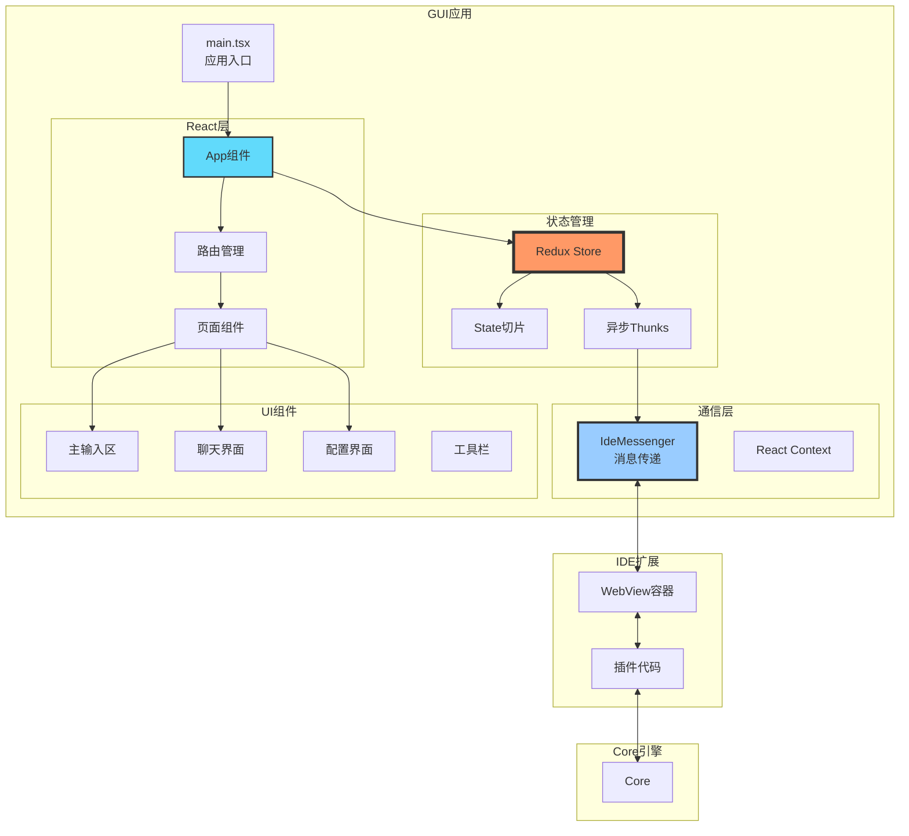
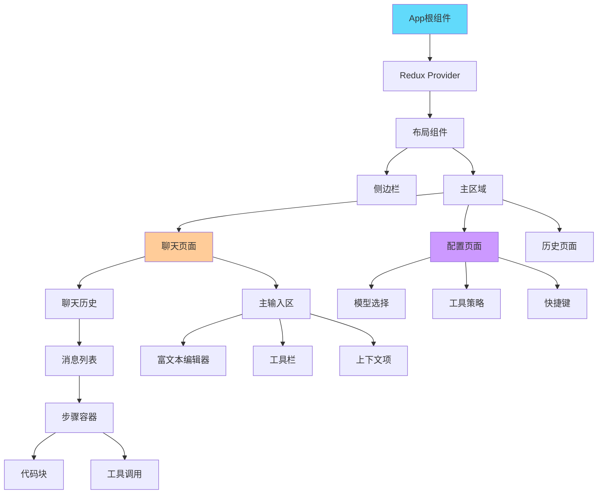

# Continue GUI模块架构设计文档

## 概述

Continue的GUI模块是一个基于React和Redux的现代化Web应用，通过WebView在IDE中运行，为用户提供AI聊天、代码补全配置、历史记录管理等交互界面。本文档基于最新代码，深入分析GUI模块的架构设计、状态管理、通信机制和HBuilderX适配。

## 目录

1. [技术栈](#技术栈)
2. [架构设计](#架构设计)
3. [状态管理](#状态管理)
4. [通信机制](#通信机制)
5. [核心组件](#核心组件)
6. [HBuilderX适配](#hbuilderx适配)
7. [性能优化](#性能优化)
8. [最佳实践](#最佳实践)

## 技术栈

### 核心技术

| 技术          | 版本 | 用途         |
| ------------- | ---- | ------------ |
| React         | 18.x | UI框架       |
| Redux Toolkit | 1.9+ | 状态管理     |
| TypeScript    | 5.6+ | 类型系统     |
| TailwindCSS   | 3.3+ | 样式框架     |
| Vite          | 4.5+ | 构建工具     |
| TipTap        | 2.x  | 富文本编辑器 |

### 目录结构

```
gui/
├── src/
│   ├── main.tsx                    # 应用入口
│   ├── polyfills.ts               # HBuilderX兼容层
│   ├── components/                 # UI组件
│   │   ├── mainInput/             # 主输入区
│   │   │   ├── TipTapEditor/      # 编辑器
│   │   │   ├── Lump/              # 消息块
│   │   │   └── util/              # 工具函数
│   │   ├── StepContainer/         # 步骤容器
│   │   ├── OnboardingCard/        # 引导卡片
│   │   └── ...                    # 其他组件
│   ├── context/                   # React Context
│   │   ├── IdeMessenger.tsx       # IDE消息传递
│   │   └── LocalStorage.tsx       # 本地存储
│   ├── redux/                     # Redux状态管理
│   │   ├── store.ts              # Store配置
│   │   ├── slices/               # State切片
│   │   ├── thunks/               # 异步操作
│   │   ├── selectors/            # 选择器
│   │   └── util/                 # 工具函数
│   ├── hooks/                     # 自定义Hooks
│   │   ├── useCopy.tsx           # 复制功能
│   │   ├── useWebviewListener.ts # 消息监听
│   │   └── ...                   # 其他Hooks
│   ├── pages/                     # 页面组件
│   │   ├── chat/                 # 聊天页面
│   │   ├── config/               # 配置页面
│   │   └── ...                   # 其他页面
│   ├── util/                      # 工具函数
│   │   ├── index.ts              # 通用工具
│   │   └── localStorage.ts       # 存储工具
│   └── index.css                 # 全局样式
├── dist-hbuilderx/                # HBuilderX构建产物
└── vite.config.ts                # Vite配置
```

## 架构设计

### 整体架构



### 组件层次结构



## 状态管理

### Redux Store结构

```typescript
interface RootState {
  // 会话状态
  session: SessionState;

  // UI状态
  ui: UIState;

  // 配置状态
  config: ConfigState;

  // 历史记录状态
  history: HistoryState;
}

interface SessionState {
  // 当前对话
  history: ChatMessage[];

  // 上下文项
  contextItems: ContextItemWithId[];

  // 流式响应状态
  streamingState: {
    active: boolean;
    messageId?: string;
    content: string;
  };

  // 工具调用状态
  toolCallStates: Record<string, ToolCallState>;

  // 活动工具
  activeTools: Tool[];
}
```

### Store配置

```typescript
// redux/store.ts
import { configureStore } from "@reduxjs/toolkit";
import sessionReducer from "./slices/sessionSlice";
import uiReducer from "./slices/uiSlice";
import configReducer from "./slices/configSlice";
import historyReducer from "./slices/historySlice";

export const store = configureStore({
  reducer: {
    session: sessionReducer,
    ui: uiReducer,
    config: configReducer,
    history: historyReducer,
  },
  middleware: (getDefaultMiddleware) =>
    getDefaultMiddleware({
      serializableCheck: {
        // 忽略不可序列化的值（如AsyncGenerator）
        ignoredActions: ["session/streamResponse"],
        ignoredPaths: ["session.streamGenerator"],
      },
    }),
});

export type RootState = ReturnType<typeof store.getState>;
export type AppDispatch = typeof store.dispatch;
```

### Session切片

```typescript
// redux/slices/sessionSlice.ts
import { createSlice, PayloadAction } from "@reduxjs/toolkit";

interface SessionState {
  history: ChatMessage[];
  contextItems: ContextItemWithId[];
  streamingState: {
    active: boolean;
    messageId?: string;
    content: string;
  };
  toolCallStates: Record<string, ToolCallState>;
}

const initialState: SessionState = {
  history: [],
  contextItems: [],
  streamingState: {
    active: false,
    content: "",
  },
  toolCallStates: {},
};

const sessionSlice = createSlice({
  name: "session",
  initialState,
  reducers: {
    // 添加用户消息
    addUserMessage(state, action: PayloadAction<string>) {
      state.history.push({
        role: "user",
        content: action.payload,
        timestamp: Date.now(),
      });
    },

    // 开始流式响应
    startStreaming(state, action: PayloadAction<string>) {
      state.streamingState = {
        active: true,
        messageId: action.payload,
        content: "",
      };
    },

    // 添加流式内容
    addStreamChunk(state, action: PayloadAction<string>) {
      if (state.streamingState.active) {
        state.streamingState.content += action.payload;
      }
    },

    // 结束流式响应
    finishStreaming(state) {
      if (state.streamingState.active) {
        state.history.push({
          role: "assistant",
          content: state.streamingState.content,
          timestamp: Date.now(),
        });
        state.streamingState = {
          active: false,
          content: "",
        };
      }
    },

    // 添加上下文项
    addContextItem(state, action: PayloadAction<ContextItemWithId>) {
      state.contextItems.push(action.payload);
    },

    // 更新工具调用状态
    updateToolCallState(
      state,
      action: PayloadAction<{ id: string; state: ToolCallState }>,
    ) {
      state.toolCallStates[action.payload.id] = action.payload.state;
    },

    // 清空会话
    clearSession(state) {
      state.history = [];
      state.contextItems = [];
      state.streamingState = initialState.streamingState;
      state.toolCallStates = {};
    },
  },
});

export const {
  addUserMessage,
  startStreaming,
  addStreamChunk,
  finishStreaming,
  addContextItem,
  updateToolCallState,
  clearSession,
} = sessionSlice.actions;

export default sessionSlice.reducer;
```

### 异步Thunks

```typescript
// redux/thunks/streamResponseAfterToolCall.ts
import { createAsyncThunk } from "@reduxjs/toolkit";
import { ideMessenger } from "../../context/IdeMessenger";

export const streamResponseAfterToolCall = createAsyncThunk(
  "session/streamResponseAfterToolCall",
  async (
    payload: {
      messageId: string;
      toolCallId: string;
      toolResult: ContextItem[];
    },
    { dispatch, getState },
  ) => {
    console.log("[hbuilderx] Redux: 开始流式响应", {
      messageId: payload.messageId,
      toolCallId: payload.toolCallId,
    });

    try {
      // 开始流式响应
      dispatch(startStreaming(payload.messageId));

      // 调用IDE接口
      const generator = ideMessenger.streamRequest("llm/streamChat", {
        messages: getState().session.history,
        contextItems: [
          ...getState().session.contextItems,
          ...payload.toolResult,
        ],
      });

      // 处理流式数据
      for await (const chunk of generator) {
        if (chunk.content) {
          dispatch(addStreamChunk(chunk.content));
        }

        if (chunk.toolCalls) {
          for (const toolCall of chunk.toolCalls) {
            dispatch(handleToolCall(toolCall));
          }
        }
      }

      // 完成流式响应
      dispatch(finishStreaming());

      console.log("[hbuilderx] Redux: 流式响应完成");
    } catch (error) {
      console.error("[hbuilderx] Redux: 流式响应失败", { error });
      dispatch(finishStreaming());
      throw error;
    }
  },
);
```

### Selectors

```typescript
// redux/selectors/selectActiveTools.ts
import { createSelector } from "@reduxjs/toolkit";
import type { RootState } from "../store";

export const selectActiveTools = createSelector(
  (state: RootState) => state.session.toolCallStates,
  (state: RootState) => state.config.tools,
  (toolCallStates, allTools) => {
    const activeToolIds = Object.keys(toolCallStates).filter(
      (id) => toolCallStates[id].status === "running",
    );

    return allTools.filter((tool) =>
      activeToolIds.some(
        (id) => toolCallStates[id].toolName === tool.function.name,
      ),
    );
  },
);

export const selectStreamingContent = createSelector(
  (state: RootState) => state.session.streamingState,
  (streamingState) => {
    if (!streamingState.active) {
      return null;
    }
    return streamingState.content;
  },
);

export const selectContextItemsByProvider = createSelector(
  (state: RootState) => state.session.contextItems,
  (contextItems) => {
    const grouped: Record<string, ContextItemWithId[]> = {};

    for (const item of contextItems) {
      const provider = item.id.providerTitle;
      if (!grouped[provider]) {
        grouped[provider] = [];
      }
      grouped[provider].push(item);
    }

    return grouped;
  },
);
```

## 通信机制

### IdeMessenger实现

```typescript
// context/IdeMessenger.tsx
import { isHBuilderX, isJetBrains } from "../util";

declare const vscode: any;
declare const hbuilderx: any;

export class IdeMessenger {
  // 发送消息
  post<T extends keyof FromWebviewProtocol>(
    messageType: T,
    data: FromWebviewProtocol[T][0],
    messageId?: string,
  ): void {
    if (isHBuilderX()) {
      // HBuilderX消息发送
      if (!hbuilderx.postMessage) {
        throw new Error("hbuilderx.postMessage is undefined");
      }

      const msg = { messageId, messageType, data };
      hbuilderx.postMessage(msg);

      console.log("[hbuilderx] GUI: 发送消息", { messageType });
    } else if (isJetBrains()) {
      // IntelliJ消息发送
      window.postIntellijMessage?.(messageType, data, messageId);
    } else {
      // VSCode消息发送
      if (!vscode.postMessage) {
        throw new Error("vscode.postMessage is undefined");
      }
      vscode.postMessage({ messageId, messageType, data });
    }
  }

  // 请求-响应模式
  request<T extends keyof FromWebviewProtocol>(
    messageType: T,
    data: FromWebviewProtocol[T][0],
  ): Promise<FromWebviewProtocol[T][1]> {
    const messageId = uuidv4();

    return new Promise((resolve, reject) => {
      const timeout = setTimeout(() => {
        reject(new Error(`Request timeout: ${messageType}`));
      }, 30000); // 30秒超时

      if (isHBuilderX()) {
        // HBuilderX消息监听
        const handler = (msg: any) => {
          if (msg.messageId === messageId) {
            clearTimeout(timeout);
            resolve(msg.data);
          }
        };

        if (hbuilderx.onDidReceiveMessage) {
          hbuilderx.onDidReceiveMessage(handler);
        }
      } else {
        // VSCode/IntelliJ消息监听
        const handler = (event: MessageEvent) => {
          if (event.data.messageId === messageId) {
            clearTimeout(timeout);
            window.removeEventListener("message", handler);
            resolve(event.data.data);
          }
        };
        window.addEventListener("message", handler);
      }

      this.post(messageType, data, messageId);
    });
  }

  // 流式请求
  streamRequest<T extends keyof FromWebviewProtocol>(
    messageType: T,
    data: FromWebviewProtocol[T][0],
    cancelToken?: AbortSignal,
  ): AsyncGenerator<any> {
    const messageId = uuidv4();
    const buffer: any[] = [];
    let done = false;
    let error: string | undefined = undefined;

    // 设置消息处理器
    if (isHBuilderX()) {
      const handler = (msg: any) => {
        if (msg.messageId === messageId) {
          if ("error" in msg.data) {
            error = msg.data.error;
            return;
          }
          if (msg.data.done) {
            done = true;
          } else {
            buffer.push(msg.data.content);
          }
        }
      };

      if (hbuilderx.onDidReceiveMessage) {
        hbuilderx.onDidReceiveMessage(handler);
      }
    } else {
      const handler = (event: MessageEvent) => {
        if (event.data.messageId === messageId) {
          if ("error" in event.data.data) {
            error = event.data.data.error;
            return;
          }
          if (event.data.data.done) {
            window.removeEventListener("message", handler);
            done = true;
          } else {
            buffer.push(event.data.data.content);
          }
        }
      };
      window.addEventListener("message", handler);
    }

    // 取消处理
    if (cancelToken) {
      cancelToken.addEventListener("abort", () => {
        this.post("abort", undefined, messageId);
      });
    }

    // 发送请求
    this.post(messageType, data, messageId);

    // 返回异步生成器
    return (async function* () {
      while (!done) {
        if (error) {
          throw new Error(error);
        }
        if (buffer.length > 0) {
          yield buffer.shift();
        } else {
          await new Promise((resolve) => setTimeout(resolve, 50));
        }
      }

      while (buffer.length > 0) {
        yield buffer.shift();
      }
    })();
  }
}

export const ideMessenger = new IdeMessenger();
```

### 消息监听Hook

```typescript
// hooks/useWebviewListener.ts
import { useEffect } from "react";
import { isHBuilderX } from "../util";

export function useWebviewListener<T extends keyof ToWebviewProtocol>(
  messageType: T,
  handler: (data: ToWebviewProtocol[T][0]) => void,
) {
  useEffect(() => {
    if (isHBuilderX()) {
      // HBuilderX消息监听
      const listener = (msg: any) => {
        if (msg.messageType === messageType) {
          console.log("[hbuilderx] GUI: 收到消息", { messageType });
          handler(msg.data);
        }
      };

      if (typeof hbuilderx !== "undefined" && hbuilderx.onDidReceiveMessage) {
        hbuilderx.onDidReceiveMessage(listener);
      }

      return () => {
        // HBuilderX可能不支持移除监听器
      };
    } else {
      // VSCode/IntelliJ消息监听
      const listener = (event: MessageEvent) => {
        if (event.data.messageType === messageType) {
          handler(event.data.data);
        }
      };

      window.addEventListener("message", listener);

      return () => {
        window.removeEventListener("message", listener);
      };
    }
  }, [messageType, handler]);
}
```

## 核心组件

### 主输入区（MainInput）

```typescript
// components/mainInput/MainInput.tsx
export function MainInput() {
  const dispatch = useAppDispatch();
  const [input, setInput] = useState("");
  const [contextItems, setContextItems] = useState<ContextItemWithId[]>([]);
  const isStreaming = useAppSelector((state) => state.session.streamingState.active);

  const handleSubmit = useCallback(async () => {
    if (!input.trim() || isStreaming) return;

    console.log("[hbuilderx] GUI: 提交消息", { input });

    // 添加用户消息
    dispatch(addUserMessage(input));

    // 清空输入
    setInput("");

    // 开始流式响应
    try {
      await dispatch(streamChat({
        message: input,
        contextItems,
      })).unwrap();
    } catch (error) {
      console.error("[hbuilderx] GUI: 流式响应失败", { error });
    }
  }, [input, contextItems, isStreaming, dispatch]);

  return (
    <div className="main-input">
      <ContextItemsDisplay items={contextItems} />

      <TipTapEditor
        value={input}
        onChange={setInput}
        onSubmit={handleSubmit}
        disabled={isStreaming}
      />

      <Toolbar
        onSubmit={handleSubmit}
        disabled={isStreaming}
      />
    </div>
  );
}
```

### TipTap编辑器

```typescript
// components/mainInput/TipTapEditor/TipTapEditor.tsx
import { EditorContent, useEditor } from "@tiptap/react";
import StarterKit from "@tiptap/starter-kit";

export function TipTapEditor({
  value,
  onChange,
  onSubmit,
  disabled,
}: TipTapEditorProps) {
  const editor = useEditor({
    extensions: [
      StarterKit,
      // 自定义扩展
      MentionExtension,
      CodeBlockExtension,
    ],
    content: value,
    onUpdate: ({ editor }) => {
      onChange(editor.getHTML());
    },
    editorProps: {
      attributes: {
        class: "prose prose-sm max-w-none",
      },
      handleKeyDown: (view, event) => {
        // 处理快捷键
        return handleKeyDown(event, { onSubmit });
      },
    },
    editable: !disabled,
  });

  return (
    <div className="tiptap-editor">
      <EditorContent editor={editor} />
    </div>
  );
}
```

### 聊天历史（ChatHistory）

```typescript
// components/chat/ChatHistory.tsx
export function ChatHistory() {
  const history = useAppSelector((state) => state.session.history);
  const streamingContent = useAppSelector(selectStreamingContent);
  const messagesEndRef = useRef<HTMLDivElement>(null);

  // 自动滚动到底部
  useEffect(() => {
    messagesEndRef.current?.scrollIntoView({ behavior: "smooth" });
  }, [history, streamingContent]);

  return (
    <div className="chat-history">
      {history.map((message, index) => (
        <StepContainer
          key={index}
          message={message}
          index={index}
        />
      ))}

      {streamingContent && (
        <StepContainer
          message={{
            role: "assistant",
            content: streamingContent,
          }}
          index={history.length}
          isStreaming
        />
      )}

      <div ref={messagesEndRef} />
    </div>
  );
}
```

### 步骤容器（StepContainer）

```typescript
// components/StepContainer/StepContainer.tsx
export function StepContainer({
  message,
  index,
  isStreaming = false,
}: StepContainerProps) {
  const [isExpanded, setIsExpanded] = useState(true);

  return (
    <div className={`step-container ${message.role}`}>
      {/* 头部 */}
      <div className="step-header">
        <div className="role-icon">
          {message.role === "user" ? <UserIcon /> : <AssistantIcon />}
        </div>
        <div className="role-name">
          {message.role === "user" ? "You" : "Assistant"}
        </div>
        {isStreaming && <ThinkingIndicator />}
      </div>

      {/* 内容 */}
      <div className="step-content">
        {message.content && (
          <MarkdownRenderer content={message.content} />
        )}

        {message.toolCalls && (
          <ToolCallDisplay toolCalls={message.toolCalls} />
        )}
      </div>

      {/* 工具栏 */}
      <div className="step-toolbar">
        <CopyButton content={message.content} />
        <RegenerateButton messageIndex={index} />
      </div>
    </div>
  );
}
```

## HBuilderX适配

### Polyfills加载

```typescript
// polyfills.ts
// Object.hasOwn polyfill
if (!Object.hasOwn) {
  console.log("[hbuilderx] 添加 Object.hasOwn polyfill");
  Object.defineProperty(Object, "hasOwn", {
    value: function (object: any, key: string | number | symbol): boolean {
      return Object.prototype.hasOwnProperty.call(object, key);
    },
    configurable: true,
    enumerable: false,
    writable: true,
  });
}

// Array.prototype.at polyfill
if (!Array.prototype.at) {
  console.log("[hbuilderx] 添加 Array.prototype.at polyfill");
  Array.prototype.at = function (index: number) {
    const len = this.length;
    if (index < 0) {
      index = len + index;
    }
    return this[index];
  };
}

// Promise.allSettled polyfill
if (!Promise.allSettled) {
  console.log("[hbuilderx] 添加 Promise.allSettled polyfill");
  Promise.allSettled = function (promises: readonly unknown[]) {
    return Promise.all(
      promises.map((promise) =>
        Promise.resolve(promise)
          .then((value) => ({ status: "fulfilled" as const, value }))
          .catch((reason) => ({ status: "rejected" as const, reason })),
      ),
    );
  };
}

console.log("[hbuilderx] Polyfills 加载完成");
```

### IDE识别

```typescript
// util/index.ts
export function isHBuilderX(): boolean {
  return typeof (window as any).hbuilderx !== "undefined";
}

export function isJetBrains(): boolean {
  return typeof (window as any).postIntellijMessage !== "undefined";
}

export function isVSCode(): boolean {
  return !isHBuilderX() && !isJetBrains();
}

export function getIdeType(): "vscode" | "hbuilderx" | "intellij" {
  if (isHBuilderX()) return "hbuilderx";
  if (isJetBrains()) return "intellij";
  return "vscode";
}
```

### 本地存储适配

```typescript
// context/LocalStorage.tsx
import { isHBuilderX } from "../util";

export class LocalStorageManager {
  getItem(key: string): string | null {
    try {
      const value = localStorage.getItem(key);
      if (isHBuilderX()) {
        console.log("[hbuilderx] LocalStorage.getItem", {
          key,
          hasValue: !!value,
        });
      }
      return value;
    } catch (error) {
      console.error("[hbuilderx] LocalStorage.getItem failed", { key, error });
      return null;
    }
  }

  setItem(key: string, value: string): void {
    try {
      localStorage.setItem(key, value);
      if (isHBuilderX()) {
        console.log("[hbuilderx] LocalStorage.setItem", { key });
      }
    } catch (error) {
      console.error("[hbuilderx] LocalStorage.setItem failed", { key, error });
    }
  }
}

export const localStorageManager = new LocalStorageManager();
```

## 性能优化

### 1. 虚拟化长列表

```typescript
import { FixedSizeList } from "react-window";

export function VirtualizedMessageList({ messages }: Props) {
  const Row = ({ index, style }: any) => (
    <div style={style}>
      <StepContainer message={messages[index]} index={index} />
    </div>
  );

  return (
    <FixedSizeList
      height={600}
      itemCount={messages.length}
      itemSize={150}
      width="100%"
    >
      {Row}
    </FixedSizeList>
  );
}
```

### 2. 组件懒加载

```typescript
import { lazy, Suspense } from "react";

const ConfigPage = lazy(() => import("./pages/config/ConfigPage"));
const HistoryPage = lazy(() => import("./pages/history/HistoryPage"));

export function App() {
  return (
    <Suspense fallback={<LoadingSpinner />}>
      <Routes>
        <Route path="/config" element={<ConfigPage />} />
        <Route path="/history" element={<ConfigPage />} />
      </Routes>
    </Suspense>
  );
}
```

### 3. useMemo和useCallback

```typescript
export function ExpensiveComponent({ data }: Props) {
  // 缓存计算结果
  const processedData = useMemo(() => {
    return expensiveOperation(data);
  }, [data]);

  // 缓存回调函数
  const handleClick = useCallback(() => {
    doSomething(processedData);
  }, [processedData]);

  return (
    <div onClick={handleClick}>
      {processedData.map((item) => (
        <Item key={item.id} data={item} />
      ))}
    </div>
  );
}
```

### 4. Redux性能优化

```typescript
// 使用createSelector避免重复计算
import { createSelector } from "@reduxjs/toolkit";

export const selectVisibleMessages = createSelector(
  (state: RootState) => state.session.history,
  (state: RootState) => state.ui.filters,
  (history, filters) => {
    return history.filter((msg) => {
      if (filters.role && msg.role !== filters.role) return false;
      if (filters.search && !msg.content.includes(filters.search)) return false;
      return true;
    });
  },
);
```

## 最佳实践

### 1. 类型安全

```typescript
// 使用严格的类型定义
interface StrictProps {
  readonly message: ChatMessage;
  readonly index: number;
  readonly onAction?: (action: string) => void;
}

// 使用类型守卫
function isChatMessage(obj: any): obj is ChatMessage {
  return (
    typeof obj === "object" &&
    typeof obj.role === "string" &&
    typeof obj.content === "string"
  );
}
```

### 2. 错误边界

```typescript
class ErrorBoundary extends React.Component<Props, State> {
  state = { hasError: false, error: null };

  static getDerivedStateFromError(error: Error) {
    return { hasError: true, error };
  }

  componentDidCatch(error: Error, errorInfo: ErrorInfo) {
    console.error("[hbuilderx] GUI: 组件错误", { error, errorInfo });
  }

  render() {
    if (this.state.hasError) {
      return <ErrorDisplay error={this.state.error} />;
    }

    return this.props.children;
  }
}
```

### 3. 自定义Hooks

```typescript
// hooks/useChatSession.ts
export function useChatSession() {
  const dispatch = useAppDispatch();
  const history = useAppSelector((state) => state.session.history);
  const isStreaming = useAppSelector(
    (state) => state.session.streamingState.active,
  );

  const sendMessage = useCallback(
    async (content: string, contextItems: ContextItemWithId[]) => {
      dispatch(addUserMessage(content));
      await dispatch(streamChat({ message: content, contextItems })).unwrap();
    },
    [dispatch],
  );

  const clearSession = useCallback(() => {
    dispatch(clearSession());
  }, [dispatch]);

  return {
    history,
    isStreaming,
    sendMessage,
    clearSession,
  };
}
```

### 4. 样式组织

```css
/* 使用BEM命名规范 */
.main-input {
  display: flex;
  flex-direction: column;
  gap: 1rem;
}

.main-input__editor {
  flex: 1;
  min-height: 100px;
}

.main-input__toolbar {
  display: flex;
  justify-content: space-between;
  align-items: center;
}

.main-input__toolbar--disabled {
  opacity: 0.5;
  pointer-events: none;
}
```

## 总结

Continue的GUI模块是一个现代化的React应用，具有以下特点：

1. **清晰的架构**：组件化、模块化的设计
2. **强大的状态管理**：使用Redux Toolkit管理复杂状态
3. **灵活的通信机制**：支持多IDE的消息传递
4. **丰富的UI组件**：现代化的用户界面
5. **完善的HBuilderX适配**：Polyfills、IDE识别、消息适配
6. **性能优化**：虚拟化、懒加载、缓存
7. **最佳实践**：类型安全、错误处理、代码组织

通过深入理解GUI模块的设计和实现，可以更好地进行UI开发、性能优化和IDE适配。
